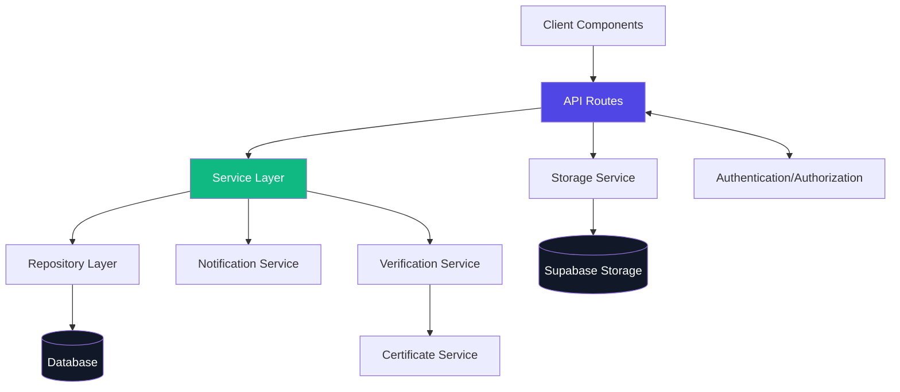

# Business Owner Details Page - Backend Architecture Documentation

## 1. Architecture Overview

The backend architecture for the Business Owner Details page follows a robust, layered approach designed to support all UI components, ensure data security, and maintain high performance. This document outlines the complete backend implementation required to power the Business Owner Details page and its various tabs.



### 1.1 Key Components

- **API Routes**: Next.js API handlers that process client requests
- **Service Layer**: Business logic implementation
- **Repository Layer**: Data access for Business Owner and related entities
- **Storage Service**: Document management
- **Verification Service**: Owner verification workflows
- **Certificate Service**: Generation and validation of verification certificates

## 2. Data Models (Extended Prisma Schema)

Below are the key data models required to support the Business Owner Details page functionality:

```prisma
// Extended from existing Prisma models in Sprint 3.0

// Needed for Profile Tab
model BusinessOwner {
  id                    String    @id @default(uuid())
  // Existing fields from sprint 3.0
  firstName             String
  lastName              String
  maternalLastName      String?
  email                 String    @unique
  phone                 String?
  dateOfBirth           DateTime?
  taxId                 String?   // Encrypt sensitive data
  idLicenseNumber       String?
  addressLine1          String?
  addressLine2          String?
  city                  String?
  state                 String?   // Consider an enum for standardization
  zipCode               String?
  verificationStatus    VerificationStatus @default(UNVERIFIED)
  lastVerifiedAt        DateTime?
  verificationExpiresAt DateTime?
  assignedManagerId     String?   // Relation to User model
  
  // Relations
  assignedManager       User?     @relation("ManagedOwners", fields: [assignedManagerId], references: [id])
  user                  User?     @relation("OwnerProfile", fields: [userId], references: [id])
  userId                String?   @unique
  documents             Document[]
  businesses            BusinessAssociation[]
  notes                 OwnerNote[]
  verificationAttempts  VerificationAttempt[]
  activityLogs          ActivityLog[]
  
  // Tracking fields
  createdAt             DateTime  @default(now())
  updatedAt             DateTime  @updatedAt
  deletedAt             DateTime? // Soft delete

  @@index([verificationStatus])
  @@index([assignedManagerId])
  @@index([email])
}

// Needed for Document Tab
model Document {
  id                String    @id @default(uuid())
  filename          String
  storagePath       String    // Path in Supabase Storage
  contentType       String    // MIME type
  fileSize          Int       // Size in bytes
  category          String    // identification, proof_of_address, etc.
  status            DocumentStatus @default(UPLOADED)
  
  // Polymorphic relationship
  ownerId           String?
  businessId        String?
  permitId          String?
  
  // Owner relation
  owner             BusinessOwner? @relation(fields: [ownerId], references: [id])
  
  // Verification related fields
  verificationStatus DocumentVerificationStatus? 
  verificationNotes  String?
  verificationDate   DateTime?
  
  // Document verifications in verification attempts
  documentVerifications DocumentVerification[]
  
  // Tracking fields
  uploadedAt        DateTime  @default(now())
  updatedAt         DateTime  @updatedAt
  
  @@index([ownerId])
  @@index([category])
  @@index([status])
}

// Needed for Notes Tab
model OwnerNote {
  id               String   @id @default(uuid())
  ownerId          String
  owner            BusinessOwner @relation(fields: [ownerId], references: [id])
  authorId         String
  author           User     @relation(fields: [authorId], references: [id])
  content          String   @db.Text
  isPinned         Boolean  @default(false)
  category         String?  // For categorizing notes
  tags             String[] // For filtering
  createdAt        DateTime @default(now())
  updatedAt        DateTime @updatedAt
  
  @@index([ownerId])
  @@index([authorId])
}

// Needed for Business Tab
model BusinessAssociation {
  ownerId             String
  businessId          String
  owner               BusinessOwner @relation(fields: [ownerId], references: [id])
  business            Business     @relation(fields: [businessId], references: [id])
  roleInBusiness      String       // Owner, Director, etc.
  ownershipPercentage Float?       // e.g., 25.5%
  isPrimaryContact    Boolean      @default(false)
  startDate           DateTime     @default(now())
  endDate             DateTime?    // For keeping historical records
  
  @@id([ownerId, businessId])
  @@index([businessId])
}

// Needed for Account & Access Tab
model User {
  // Existing fields from sprint 3.0
  id                  String    @id
  email               String    @unique
  role                Role      @default(BUSINESS_OWNER)
  emailVerified       Boolean   @default(false)
  lastLogin           DateTime?
  mfaEnabled          Boolean   @default(false)
  accountStatus       UserStatus @default(ACTIVE)
  
  // Relations
  managedOwners       BusinessOwner[] @relation("ManagedOwners")
  businessOwnerProfile BusinessOwner? @relation("OwnerProfile")
  authoredNotes       OwnerNote[]
  
  // Tracking fields
  createdAt           DateTime  @default(now())
  updatedAt           DateTime  @updatedAt
}

// Needed for History Tab
model ActivityLog {
  id                  String    @id @default(uuid())
  entityType          String    // BusinessOwner, Document, etc.
  entityId            String    // UUID of the entity
  action              String    // Created, Updated, Verified, etc.
  performedBy         String    // User ID
  details             Json?     // Additional information
  timestamp           DateTime  @default(now())
  
  // Optional relation to BusinessOwner for quick access
  ownerId             String?
  owner               BusinessOwner? @relation(fields: [ownerId], references: [id])
  
  @@index([entityType, entityId])
  @@index([ownerId])
  @@index([timestamp])
}

// Needed for Verification Details Tab
model VerificationAttempt {
  id                   String    @id @default(uuid())
  businessOwnerId      String
  businessOwner        BusinessOwner @relation(fields: [businessOwnerId], references: [id])
  initiatedBy          String    // User ID of Permit Manager
  initiatedAt          DateTime  @default(now())
  completedAt          DateTime?
  decision             VerificationDecision?
  decisionReason       String?
  
  // Certificate relation
  certificate          VerificationCertificate?
  
  // Section statuses and data
  sections             Json      // Stores verification statuses by section
  draftData            Json?     // For auto-save functionality 
  
  // Relations
  documentVerifications DocumentVerification[]
  historyLogs          VerificationHistoryLog[]
  
  // Tracking
  lastUpdated          DateTime  @updatedAt
  
  @@index([businessOwnerId])
  @@index([initiatedBy])
}

model DocumentVerification {
  id                   String    @id @default(uuid())
  verificationId       String
  verification         VerificationAttempt @relation(fields: [verificationId], references: [id])
  documentId           String
  document             Document  @relation(fields: [documentId], references: [id])
  status               DocumentVerificationStatus
  notes                String?
  verifiedBy           String    // User ID
  verifiedAt           DateTime  @default(now())
  
  @@unique([verificationId, documentId])
  @@index([documentId])
}

model VerificationCertificate {
  id                   String    @id @default(uuid())
  verificationId       String    @unique
  verification         VerificationAttempt @relation(fields: [verificationId], references: [id])
  issuedAt             DateTime  @default(now())
  expiresAt            DateTime
  documentPath         String    // Path in Supabase Storage
  verificationHash     String    // Digital fingerprint for validation
  isRevoked            Boolean   @default(false)
  revokedAt            DateTime?
  revokedReason        String?
  
  @@index([verificationId])
}

model VerificationHistoryLog {
  id                   String    @id @default(uuid())
  verificationId       String
  verification         VerificationAttempt @relation(fields: [verificationId], references: [id])
  action               String
  performedBy          String    // User ID
  performedAt          DateTime  @default(now())
  details              Json?
  
  @@index([verificationId])
}

// Enums
enum VerificationStatus {
  UNVERIFIED
  PENDING_VERIFICATION
  VERIFIED
  REJECTED
  NEEDS_INFO
}

enum VerificationDecision {
  VERIFIED
  REJECTED
  NEEDS_INFO
}

enum DocumentStatus {
  UPLOADED
  PROCESSING
  READY
  ERROR
}

enum DocumentVerificationStatus {
  PENDING
  VERIFIED
  UNREADABLE
  EXPIRED
  INCONSISTENT_DATA
  SUSPECTED_FRAUD
  OTHER_ISSUE
  NOT_APPLICABLE
}

enum UserStatus {
  ACTIVE
  SUSPENDED
  LOCKED
  DELETED
}

enum Role {
  SYSTEM_ADMIN
  ADMIN
  PERMIT_MANAGER
  BUSINESS_OWNER
  READ_ONLY
}
```

## 3. API Endpoints

### 3.1 Business Owner Details API

```typescript
// File: src/app/api/business-owners/[id]/route.ts

import { NextRequest, NextResponse } from 'next/server';
import { getServerSession } from 'next-auth/next';
import { prisma } from '@/lib/prisma';
import { businessOwnerService } from '@/lib/services/businessOwnerService';
import { authOptions } from '@/lib/auth';
import { createResponse, handleApiError } from '@/lib/apiUtils';
import { validateRequest } from '@/lib/validateRequest';
import { updateOwnerSchema } from '@/lib/validationSchemas';

/**
 * Get Business Owner by ID with comprehensive details
 */
export async function GET(
  request: NextRequest,
  { params }: { params: { id: string } }
) {
  try {
    // Authenticate and authorize user
    const session = await getServerSession(authOptions);
    if (!session) {
      return createResponse({ error: 'Unauthorized' }, { status: 401 });
    }
    
    const { id } = params;
    
    // Get query parameters
    const { searchParams } = new URL(request.url);
    const includeDocuments = searchParams.get('includeDocuments') === 'true';
    const includeBusinesses = searchParams.get('includeBusinesses') === 'true';
    const includeNotes = searchParams.get('includeNotes') === 'true';
    const includeHistory = searchParams.get('includeHistory') === 'true';
    const includeVerification = searchParams.get('includeVerification') === 'true';
    
    // Fetch business owner with related data
    const businessOwner = await businessOwnerService.getBusinessOwnerById(
      id, 
      session.user.id, 
      {
        includeDocuments,
        includeBusinesses,
        includeNotes,
        includeHistory,
        includeVerification
      }
    );
    
    if (!businessOwner) {
      return createResponse({ error: 'Business owner not found' }, { status: 404 });
    }
    
    // Check if user is authorized to access this business owner
    const isAuthorized = 
      session.user.role === 'SYSTEM_ADMIN' || 
      session.user.role === 'ADMIN' ||
      (session.user.role === 'PERMIT_MANAGER' && businessOwner.assignedManagerId === session.user.id);
    
    if (!isAuthorized) {
      return createResponse({ error: 'Forbidden' }, { status: 403 });
    }
    
    // Mask sensitive fields for non-admin roles
    const sanitizedOwner = businessOwnerService.sanitizeOwnerData(businessOwner, session.user.role);
    
    return createResponse(sanitizedOwner);
  } catch (error) {
    return handleApiError(error);
  }
}

/**
 * Update Business Owner by ID
 */
export async function PUT(
  request: NextRequest,
  { params }: { params: { id: string } }
) {
  try {
    // Authenticate and authorize user
    const session = await getServerSession(authOptions);
    if (!session) {
      return createResponse({ error: 'Unauthorized' }, { status: 401 });
    }
    
    const { id } = params;
    
    // Validate request body
    const body = await request.json();
    const { data, error: validationError } = validateRequest(body, updateOwnerSchema);
    
    if (validationError) {
      return createResponse({ error: validationError }, { status: 400 });
    }
    
    // Check if user is authorized to update this business owner
    const existingOwner = await businessOwnerService.getBusinessOwnerById(id, session.user.id);
    
    if (!existingOwner) {
      return createResponse({ error: 'Business owner not found' }, { status: 404 });
    }
    
    const isAuthorized = 
      session.user.role === 'SYSTEM_ADMIN' || 
      session.user.role === 'ADMIN' ||
      (session.user.role === 'PERMIT_MANAGER' && existingOwner.assignedManagerId === session.user.id);
    
    if (!isAuthorized) {
      return createResponse({ error: 'Forbidden' }, { status: 403 });
    }
    
    // Block updates to verified owners for some fields if not admin
    if (existingOwner.verificationStatus === 'VERIFIED' && 
        session.user.role !== 'SYSTEM_ADMIN' && 
        session.user.role !== 'ADMIN') {
      
      // Check if trying to update protected fields
      const protectedFields = ['firstName', 'lastName', 'dateOfBirth', 'taxId', 'idLicenseNumber'];
      const isUpdatingProtectedFields = protectedFields.some(field => 
        data[field] !== undefined && data[field] !== existingOwner[field]
      );
      
      if (isUpdatingProtectedFields) {
        return createResponse({ 
          error: 'Cannot modify protected fields of a verified business owner' 
        }, { status: 403 });
      }
    }
    
    // Update business owner
    const updatedOwner = await businessOwnerService.updateBusinessOwner(id, data, session.user.id);
    
    // Mask sensitive fields for response
    const sanitizedOwner = businessOwnerService.sanitizeOwnerData(updatedOwner, session.user.role);
    
    return createResponse(sanitizedOwner);
  } catch (error) {
    return handleApiError(error);
  }
}
```

### 3.2 Documents API

```typescript
// File: src/app/api/business-owners/[id]/documents/route.ts

import { NextRequest, NextResponse } from 'next/server';
import { getServerSession } from 'next-auth/next';
import { authOptions } from '@/lib/auth';
import { createResponse, handleApiError } from '@/lib/apiUtils';
import { documentService } from '@/lib/services/documentService';
import { businessOwnerService } from '@/lib/services/businessOwnerService';

/**
 * Get documents for a business owner
 */
export async function GET(
  request: NextRequest,
  { params }: { params: { id: string } }
) {
  try {
    // Authenticate and authorize user
    const session = await getServerSession(authOptions);
    if (!session) {
      return createResponse({ error: 'Unauthorized' }, { status: 401 });
    }
    
    const { id } = params;
    
    // Get query parameters
    const { searchParams } = new URL(request.url);
    const category = searchParams.get('category');
    const status = searchParams.get('status');
    const page = parseInt(searchParams.get('page') || '1');
    const limit = Math.min(parseInt(searchParams.get('limit') || '10'), 50); // Max 50 per page
    
    // Check if user is authorized to access this business owner
    const existingOwner = await businessOwnerService.getBusinessOwnerById(id, session.user.id, { lean: true });
    
    if (!existingOwner) {
      return createResponse({ error: 'Business owner not found' }, { status: 404 });
    }
    
    const isAuthorized = 
      session.user.role === 'SYSTEM_ADMIN' || 
      session.user.role === 'ADMIN' ||
      (session.user.role === 'PERMIT_MANAGER' && existingOwner.assignedManagerId === session.user.id);
    
    if (!isAuthorized) {
      return createResponse({ error: 'Forbidden' }, { status: 403 });
    }
    
    // Fetch documents with pagination and filtering
    const { documents, total } = await documentService.getDocumentsForOwner(
      id,
      {
        category,
        status,
        page,
        limit
      }
    );
    
    // Generate pre-signed URLs for document access
    const documentsWithUrls = await Promise.all(
      documents.map(async (doc) => {
        const url = await documentService.getDocumentUrl(doc.id);
        return {
          ...doc,
          url
        };
      })
    );
    
    return createResponse({
      data: documentsWithUrls,
      pagination: {
        total,
        page,
        limit,
        pages: Math.ceil(total / limit)
      }
    });
  } catch (error) {
    return handleApiError(error);
  }
}

/**
 * Upload a new document for a business owner
 */
export async function POST(
  request: NextRequest,
  { params }: { params: { id: string } }
) {
  try {
    // Authenticate and authorize user
    const session = await getServerSession(authOptions);
    if (!session) {
      return createResponse({ error: 'Unauthorized' }, { status: 401 });
    }
    
    const { id } = params;
    
    // Check if user is authorized to upload documents for this business owner
    const existingOwner = await businessOwnerService.getBusinessOwnerById(id, session.user.id, { lean: true });
    
    if (!existingOwner) {
      return createResponse({ error: 'Business owner not found' }, { status: 404 });
    }
    
    const isAuthorized = 
      session.user.role === 'SYSTEM_ADMIN' || 
      session.user.role === 'ADMIN' ||
      (session.user.role === 'PERMIT_MANAGER' && existingOwner.assignedManagerId === session.user.id);
    
    if (!isAuthorized) {
      return createResponse({ error: 'Forbidden' }, { status: 403 });
    }
    
    // Parse the form data (multipart/form-data)
    const formData = await request.formData();
    const file = formData.get('file') as File;
    const category = formData.get('category') as string;
    const notes = formData.get('notes') as string;
    
    // Validate file and upload
    const subscription = await businessOwnerService.getManagerSubscription(existingOwner.assignedManagerId);
    const maxSizeBytes = subscription?.tier === 'BUSINESS' ? 50 * 1024 * 1024 : 5 * 1024 * 1024; // 50MB or 5MB
    
    if (!file) {
      return createResponse({ error: 'No file provided' }, { status: 400 });
    }
    
    if (!category) {
      return createResponse({ error: 'Document category is required' }, { status: 400 });
    }
    
    // Check file size
    if (file.size > maxSizeBytes) {
      return createResponse({ 
        error: `File size exceeds the limit (${maxSizeBytes / 1024 / 1024} MB)`
      }, { status: 413 });
    }
    
    // Check file type
    const allowedTypes = ['image/jpeg', 'image/png', 'application/pdf'];
    if (!allowedTypes.includes(file.type)) {
      return createResponse({ 
        error: 'Invalid file type. Only JPG, PNG, and PDF files are allowed'
      }, { status: 400 });
    }
    
    // Upload document
    const document = await documentService.uploadDocument(
      file,
      {
        ownerId: id,
        category,
        notes,
        uploadedBy: session.user.id
      }
    );
    
    // Generate pre-signed URL for immediate access
    const url = await documentService.getDocumentUrl(document.id);
    
    // Log activity
    await businessOwnerService.logActivity({
      entityType: 'Document',
      entityId: document.id,
      action: 'Created',
      performedBy: session.user.id,
      ownerId: id,
      details: {
        documentType: file.type,
        category,
        size: file.size
      }
    });
    
    return createResponse({
      ...document,
      url
    }, { status: 201 });
  } catch (error) {
    return handleApiError(error);
  }
}
```

### 3.3 Document Detail API

```typescript
// File: src/app/api/business-owners/[id]/documents/[documentId]/route.ts

import { NextRequest, NextResponse } from 'next/server';
import { getServerSession } from 'next-auth/next';
import { authOptions } from '@/lib/auth';
import { createResponse, handleApiError } from '@/lib/apiUtils';
import { documentService } from '@/lib/services/documentService';
import { businessOwnerService } from '@/lib/services/businessOwnerService';

/**
 * Get document details
 */
export async function GET(
  request: NextRequest,
  { params }: { params: { id: string, documentId: string } }
) {
  try {
    // Authenticate and authorize user
    const session = await getServerSession(authOptions);
    if (!session) {
      return createResponse({ error: 'Unauthorized' }, { status: 401 });
    }
    
    const { id, documentId } = params;
    
    // Check if user is authorized to access this business owner
    const existingOwner = await businessOwnerService.getBusinessOwnerById(id, session.user.id, { lean: true });
    
    if (!existingOwner) {
      return createResponse({ error: 'Business owner not found' }, { status: 404 });
    }
    
    const isAuthorized = 
      session.user.role === 'SYSTEM_ADMIN' || 
      session.user.role === 'ADMIN' ||
      (session.user.role === 'PERMIT_MANAGER' && existingOwner.assignedManagerId === session.user.id);
    
    if (!isAuthorized) {
      return createResponse({ error: 'Forbidden' }, { status: 403 });
    }
    
    // Get document
    const document = await documentService.getDocumentById(documentId);
    
    if (!document) {
      return createResponse({ error: 'Document not found' }, { status: 404 });
    }
    
    // Ensure document belongs to this business owner
    if (document.ownerId !== id) {
      return createResponse({ error: 'Document does not belong to this business owner' }, { status: 403 });
    }
    
    // Generate pre-signed URL for document access
    const url = await documentService.getDocumentUrl(document.id);
    
    return createResponse({
      ...document,
      url
    });
  } catch (error) {
    return handleApiError(error);
  }
}

/**
 * Update document status or metadata
 */
export async function PUT(
  request: NextRequest,
  { params }: { params: { id: string, documentId: string } }
) {
  try {
    // Authenticate and authorize user
    const session = await getServerSession(authOptions);
    if (!session) {
      return createResponse({ error: 'Unauthorized' }, { status: 401 });
    }
    
    const { id, documentId } = params;
    const body = await request.json();
    
    // Check if user is authorized
    const existingOwner = await businessOwnerService.getBusinessOwnerById(id, session.user.id, { lean: true });
    
    if (!existingOwner) {
      return createResponse({ error: 'Business owner not found' }, { status: 404 });
    }
    
    const isAuthorized = 
      session.user.role === 'SYSTEM_ADMIN' || 
      session.user.role === 'ADMIN' ||
      (session.user.role === 'PERMIT_MANAGER' && existingOwner.assignedManagerId === session.user.id);
    
    if (!isAuthorized) {
      return createResponse({ error: 'Forbidden' }, { status: 403 });
    }
    
    // Get document
    const document = await documentService.getDocumentById(documentId);
    
    if (!document) {
      return createResponse({ error: 'Document not found' }, { status: 404 });
    }
    
    // Ensure document belongs to this business owner
    if (document.ownerId !== id) {
      return createResponse({ error: 'Document does not belong to this business owner' }, { status: 403 });
    }
    
    // Update document (only allows updating status, verificationStatus, and verificationNotes)
    const updatedDocument = await documentService.updateDocument(
      documentId,
      {
        status: body.status,
        verificationStatus: body.verificationStatus,
        verificationNotes: body.verificationNotes,
      },
      session.user.id
    );
    
    // Generate pre-signed URL for document access
    const url = await documentService.getDocumentUrl(updatedDocument.id);
    
    return createResponse({
      ...updatedDocument,
      url
    });
  } catch (error) {
    return handleApiError(error);
  }
}

/**
 * Delete document
 */
export async function DELETE(
  request: NextRequest,
  { params }: { params: { id: string, documentId: string } }
) {
  try {
    // Authenticate and authorize user
    const session = await getServerSession(authOptions);
    if (!session) {
      return createResponse({ error: 'Unauthorized' }, { status: 401 });
    }
    
    const { id, documentId } = params;
    
    // Check if user is authorized
    const existingOwner = await businessOwnerService.getBusinessOwnerById(id, session.user.id, { lean: true });
    
    if (!existingOwner) {
      return createResponse({ error: 'Business owner not found' }, { status: 404 });
    }
    
    const isAuthorized = 
      session.user.role === 'SYSTEM_ADMIN' || 
      session.user.role === 'ADMIN' ||
      (session.user.role === 'PERMIT_MANAGER' && existingOwner.assignedManagerId === session.user.id);
    
    if (!isAuthorized) {
      return createResponse({ error: 'Forbidden' }, { status: 403 });
    }
    
    // Get document
    const document = await documentService.getDocumentById(documentId);
    
    if (!document) {
      return createResponse({ error: 'Document not found' }, { status: 404 });
    }
    
    // Ensure document belongs to this business owner
    if (document.ownerId !== id) {
      return createResponse({ error: 'Document does not belong to this business owner' }, { status: 403 });
    }
    
    // Prevent deletion of verified documents
    if (document.verificationStatus === 'VERIFIED' && existingOwner.verificationStatus === 'VERIFIED') {
      return createResponse({ 
        error: 'Cannot delete verified documents for a verified business owner' 
      }, { status: 403 });
    }
    
    // Delete document
    await documentService.deleteDocument(documentId, session.user.id);
    
    // Log activity
    await businessOwnerService.logActivity({
      entityType: 'Document',
      entityId: documentId,
      action: 'Deleted',
      performedBy: session.user.id,
      ownerId: id
    });
    
    return new NextResponse(null, { status: 204 });
  } catch (error) {
    return handleApiError(error);
  }
}
```

### 3.4 Businesses API

```typescript
// File: src/app/api/business-owners/[id]/businesses/route.ts

import { NextRequest, NextResponse } from 'next/server';
import { getServerSession } from 'next-auth/next';
import { authOptions } from '@/lib/auth';
import { createResponse, handleApiError } from '@/lib/apiUtils';
import { businessOwnerService } from '@/lib/services/businessOwnerService';
import { businessService } from '@/lib/services/businessService';

/**
 * Get businesses associated with a business owner
 */
export async function GET(
  request: NextRequest,
  { params }: { params: { id: string } }
) {
  try {
    // Authenticate and authorize user
    const session = await getServerSession(authOptions);
    if (!session) {
      return createResponse({ error: 'Unauthorized' }, { status: 401 });
    }
    
    const { id } = params;
    
    // Get query parameters
    const { searchParams } = new URL(request.url);
    const page = parseInt(searchParams.get('page') || '1');
    const limit = Math.min(parseInt(searchParams.get('limit') || '10'), 50);
    
    // Check if user is authorized to access this business owner
    const existingOwner = await businessOwnerService.getBusinessOwnerById(id, session.user.id, { lean: true });
    
    if (!existingOwner) {
      return createResponse({ error: 'Business owner not found' }, { status: 404 });
    }
    
    const isAuthorized = 
      session.user.role === 'SYSTEM_ADMIN' || 
      session.user.role === 'ADMIN' ||
      (session.user.role === 'PERMIT_MANAGER' && existingOwner.assignedManagerId === session.user.id);
    
    if (!isAuthorized) {
      return createResponse({ error: 'Forbidden' }, { status: 403 });
    }
    
    // Fetch businesses associated with this owner
    const { businesses, total } = await businessService.getBusinessesForOwner(
      id,
      {
        page,
        limit
      }
    );
    
    return createResponse({
      data: businesses,
      pagination: {
        total,
        page,
        limit,
        pages: Math.ceil(total / limit)
      }
    });
  } catch (error) {
    return handleApiError(error);
  }
}
```

### 3.5 Notes API

```typescript
// File: src/app/api/business-owners/[id]/notes/route.ts

import { NextRequest, NextResponse } from 'next/server';
import { getServerSession } from 'next-auth/next';
import { authOptions } from '@/lib/auth';
import { createResponse, handleApiError } from '@/lib/apiUtils';
import { businessOwnerService } from '@/lib/services/businessOwnerService';
import { noteService } from '@/lib/services/noteService';
import { validateRequest } from '@/lib/validateRequest';
import { createNoteSchema } from '@/lib/validationSchemas';

/**
 * Get notes for a business owner
 */
export async function GET(
  request: NextRequest,
  { params }: { params: { id: string } }
) {
  try {
    // Authenticate and authorize user
    const session = await getServerSession(authOptions);
    if (!session) {
      return createResponse({ error: 'Unauthorized' }, { status: 401 });
    }
    
    const { id } = params;
    
    // Get query parameters
    const { searchParams } = new URL(request.url);
    const category = searchParams.get('category');
    const page = parseInt(searchParams.get('page') || '1');
    const limit = Math.min(parseInt(searchParams.get('limit') || '10'), 50);
    
    // Check if user is authorized to access this business owner
    const existingOwner = await businessOwnerService.getBusinessOwnerById(id, session.user.id, { lean: true });
    
    if (!existingOwner) {
      return createResponse({ error: 'Business owner not found' }, { status: 404 });
    }
    
    const isAuthorized = 
      session.user.role === 'SYSTEM_ADMIN' || 
      session.user.role === 'ADMIN' ||
      (session.user.role === 'PERMIT_MANAGER' && existingOwner.assignedManagerId === session.user.id);
    
    if (!isAuthorized) {
      return createResponse({ error: 'Forbidden' }, { status: 403 });
    }
    
    // Fetch notes with pagination and filtering
    const { notes, total } = await noteService.getNotesForOwner(
      id,
      {
        category,
        page,
        limit
      }
    );
    
    return createResponse({
      data: notes,
      pagination: {
        total,
        page,
        limit,
        pages: Math.ceil(total / limit)
      }
    });
  } catch (error) {
    return handleApiError(error);
  }
}

/**
 * Create a new note for a business owner
 */
export async function POST(
  request: NextRequest,
  { params }: { params: { id: string } }
) {
  try {
    // Authenticate and authorize user
    const session = await getServerSession(authOptions);
    if (!session) {
      return createResponse({ error: 'Unauthorized' }, { status: 401 });
    }
    
    const { id } = params;
    
    // Check if user is authorized to add notes for this business owner
    const existingOwner = await businessOwnerService.getBusinessOwnerById(id, session.user.id, { lean: true });
    
    if (!existingOwner) {
      return createResponse({ error: 'Business owner not found' }, { status: 404 });
    }
    
    const isAuthorized = 
      session.user.role === 'SYSTEM_ADMIN' || 
      session.user.role === 'ADMIN' ||
      (session.user.role === 'PERMIT_MANAGER' && existingOwner.assignedManagerId === session.user.id);
    
    if (!isAuthorized) {
      return createResponse({ error: 'Forbidden' }, { status: 403 });
    }
    
    // Validate request body
    const body = await request.json();
    const { data, error: validationError } = validateRequest(body, createNoteSchema);
    
    if (validationError) {
      return createResponse({ error: validationError }, { status: 400 });
    }
    
    // Create note
    const note = await noteService.createNote({
      ownerId: id,
      authorId: session.user.id,
      content: data.content,
      category: data.category,
      tags: data.tags,
      isPinned: data.isPinned || false
    });
    
    // Log activity
    await businessOwnerService.logActivity({
      entityType: 'Note',
      entityId: note.id,
      action: 'Created',
      performedBy: session.user.id,
      ownerId: id,
      details: {
        category: data.category,
        isPinned: data.isPinned || false
      }
    });
    
    return createResponse(note, { status: 201 });
  } catch (error) {
    return handleApiError(error);
  }
}
```

### 3.6 History/Activity Log API

```typescript
// File: src/app/api/business-owners/[id]/activity-logs/route.ts

import { NextRequest, NextResponse } from 'next/server';
import { getServerSession } from 'next-auth/next';
import { authOptions } from '@/lib/auth';
import { createResponse, handleApiError } from '@/lib/apiUtils';
import { businessOwnerService } from '@/lib/services/businessOwnerService';
import { activityLogService } from '@/lib/services/activityLogService';

/**
 * Get activity logs for a business owner
 */
export async function GET(
  request: NextRequest,
  { params }: { params: { id: string } }
) {
  try {
    // Authenticate and authorize user
    const session = await getServerSession(authOptions);
    if (!session) {
      return createResponse({ error: 'Unauthorized' }, { status: 401 });
    }
    
    const { id } = params;
    
    // Get query parameters
    const { searchParams } = new URL(request.url);
    const entityType = searchParams.get('entityType');
    const action = searchParams.get('action');
    const fromDate = searchParams.get('fromDate') ? new Date(searchParams.get('fromDate')!) : undefined;
    const toDate = searchParams.get('toDate') ? new Date(searchParams.get('toDate')!) : undefined;
    const page = parseInt(searchParams.get('page') || '1');
    const limit = Math.min(parseInt(searchParams.get('limit') || '20'), 100);
    
    // Check if user is authorized to access this business owner
    const existingOwner = await businessOwnerService.getBusinessOwnerById(id, session.user.id, { lean: true });
    
    if (!existingOwner) {
      return createResponse({ error: 'Business owner not found' }, { status: 404 });
    }
    
    const isAuthorized = 
      session.user.role === 'SYSTEM_ADMIN' || 
      session.user.role === 'ADMIN' ||
      (session.user.role === 'PERMIT_MANAGER' && existingOwner.assignedManagerId === session.user.id);
    
    if (!isAuthorized) {
      return createResponse({ error: 'Forbidden' }, { status: 403 });
    }
    
    // Fetch activity logs with pagination and filtering
    const { logs, total } = await activityLogService.getActivityLogsForOwner(
      id,
      {
        entityType,
        action,
        fromDate,
        toDate,
        page,
        limit
      }
    );
    
    // Enrich logs with user data for better display
    const enrichedLogs = await activityLogService.enrichLogsWithUserData(logs);
    
    return createResponse({
      data: enrichedLogs,
      pagination: {
        total,
        page,
        limit,
        pages: Math.ceil(total / limit)
      }
    });
  } catch (error) {
    return handleApiError(error);
  }
}
```

### 3.7 Verification API

```typescript
// File: src/app/api/business-owners/[id]/verification/route.ts

import { NextRequest, NextResponse } from 'next/server';
import { getServerSession } from 'next-auth/next';
import { authOptions } from '@/lib/auth';
import { createResponse, handleApiError } from '@/lib/apiUtils';
import { businessOwnerService } from '@/lib/services/businessOwnerService';
import { verificationService } from '@/lib/services/verificationService';

/**
 * Get verification status or active attempt
 */
export async function GET(
  request: NextRequest,
  { params }: { params: { id: string } }
) {
  try {
    // Authenticate and authorize user
    const session = await getServerSession(authOptions);
    if (!session) {
      return createResponse({ error: 'Unauthorized' }, { status: 401 });
    }
    
    const { id } = params;
    
    // Get query parameters
    const { searchParams } = new URL(request.url);
    const includeDocuments = searchParams.get('includeDocuments') === 'true';
    const includeHistory = searchParams.get('includeHistory') === 'true';
    
    // Check if user is authorized to view verification details
    const existingOwner = await businessOwnerService.getBusinessOwnerById(id, session.user.id, { lean: true });
    
    if (!existingOwner) {
      return createResponse({ error: 'Business owner not found' }, { status: 404 });
    }
    
    const isAuthorized = 
      session.user.role === 'SYSTEM_ADMIN' || 
      session.user.role === 'ADMIN' ||
      (session.user.role === 'PERMIT_MANAGER' && existingOwner.assignedManagerId === session.user.id);
    
    if (!isAuthorized) {
      return createResponse({ error: 'Forbidden' }, { status: 403 });
    }
    
    // Get verification status
    const verificationData = await verificationService.getVerificationStatus(
      id,
      session.user.id,
      {
        includeDocuments,
        includeHistory
      }
    );
    
    return createResponse(verificationData);
  } catch (error) {
    return handleApiError(error);
  }
}

/**
 * Create new verification attempt or save draft
 */
export async function POST(
  request: NextRequest,
  { params }: { params: { id: string } }
) {
  try {
    // Authenticate and authorize user
    const session = await getServerSession(authOptions);
    if (!session) {
      return createResponse({ error: 'Unauthorized' }, { status: 401 });
    }
    
    const { id } = params;
    
    // Check if user is authorized to initiate verification
    const existingOwner = await businessOwnerService.getBusinessOwnerById(id, session.user.id, { lean: true });
    
    if (!existingOwner) {
      return createResponse({ error: 'Business owner not found' }, { status: 404 });
    }
    
    const isAuthorized = 
      session.user.role === 'SYSTEM_ADMIN' || 
      session.user.role === 'ADMIN' ||
      (session.user.role === 'PERMIT_MANAGER' && existingOwner.assignedManagerId === session.user.id);
    
    if (!isAuthorized) {
      return createResponse({ error: 'Forbidden' }, { status: 403 });
    }
    
    // Get request body
    const body = await request.json();
    
    // Determine if this is a draft save or new verification attempt
    if (body.isDraft) {
      // Save draft
      const result = await verificationService.saveDraft(id, session.user.id, body.draftData);
      return createResponse(result);
    } else {
      // Create new verification attempt
      const result = await verificationService.createVerificationAttempt(id, session.user.id);
      return createResponse(result, { status: 201 });
    }
  } catch (error) {
    return handleApiError(error);
  }
}

/**
 * Submit verification decision
 */
export async function PUT(
  request: NextRequest,
  { params }: { params: { id: string } }
) {
  try {
    // Authenticate and authorize user
    const session = await getServerSession(authOptions);
    if (!session) {
      return createResponse({ error: 'Unauthorized' }, { status: 401 });
    }
    
    const { id } = params;
    
    // Check if user is authorized to submit verification
    const existingOwner = await businessOwnerService.getBusinessOwnerById(id, session.user.id, { lean: true });
    
    if (!existingOwner) {
      return createResponse({ error: 'Business owner not found' }, { status: 404 });
    }
    
    const isAuthorized = 
      session.user.role === 'SYSTEM_ADMIN' || 
      session.user.role === 'ADMIN' ||
      (session.user.role === 'PERMIT_MANAGER' && existingOwner.assignedManagerId === session.user.id);
    
    if (!isAuthorized) {
      return createResponse({ error: 'Forbidden' }, { status: 403 });
    }
    
    // Validate submission data
    const body = await request.json();
    
    // Submit verification decision
    const result = await verificationService.submitVerificationDecision(
      id,
      session.user.id,
      {
        verificationId: body.verificationId,
        decision: body.decision,
        decisionReason: body.decisionReason,
        sections: body.sections
      }
    );
    
    return createResponse(result);
  } catch (error) {
    return handleApiError(error);
  }
}
```

### 3.8 Certificate API

```typescript
// File: src/app/api/business-owners/[id]/verification/certificate/route.ts

import { NextRequest, NextResponse } from 'next/server';
import { getServerSession } from 'next-auth/next';
import { authOptions } from '@/lib/auth';
import { createResponse, handleApiError } from '@/lib/apiUtils';
import { businessOwnerService } from '@/lib/services/businessOwnerService';
import { certificateService } from '@/lib/services/certificateService';

/**
 * Get verification certificate
 */
export async function GET(
  request: NextRequest,
  { params }: { params: { id: string } }
) {
  try {
    // Authenticate and authorize user
    const session = await getServerSession(authOptions);
    if (!session) {
      return createResponse({ error: 'Unauthorized' }, { status: 401 });
    }
    
    const { id } = params;
    
    // Get query parameters
    const { searchParams } = new URL(request.url);
    const certificateId = searchParams.get('id');
    const format = searchParams.get('format') || 'json'; // 'json' or 'pdf'
    
    // Check if user is authorized to view certificate
    const existingOwner = await businessOwnerService.getBusinessOwnerById(id, session.user.id, { lean: true });
    
    if (!existingOwner) {
      return createResponse({ error: 'Business owner not found' }, { status: 404 });
    }
    
    const isAuthorized = 
      session.user.role === 'SYSTEM_ADMIN' || 
      session.user.role === 'ADMIN' ||
      (session.user.role === 'PERMIT_MANAGER' && existingOwner.assignedManagerId === session.user.id);
    
    if (!isAuthorized) {
      return createResponse({ error: 'Forbidden' }, { status: 403 });
    }
    
    // If certificate ID provided, fetch that specific certificate
    // Otherwise, get the most recent certificate
    const certificateData = certificateId 
      ? await certificateService.getCertificateById(certificateId)
      : await certificateService.getOrGenerateCertificate(id, session.user.id);
    
    if (!certificateData) {
      return createResponse({ error: 'Certificate not found' }, { status: 404 });
    }
    
    // Return response based on requested format
    if (format === 'pdf') {
      // Stream the PDF directly
      const pdfBuffer = await certificateService.getCertificatePdf(certificateData.id);
      
      return new NextResponse(pdfBuffer, {
        status: 200,
        headers: {
          'Content-Type': 'application/pdf',
          'Content-Disposition': `inline; filename="verification_certificate_${id}.pdf"`,
        }
      });
    } else {
      // Return JSON with download URL
      return createResponse({
        ...certificateData,
        downloadUrl: `${request.url}&format=pdf`
      });
    }
  } catch (error) {
    return handleApiError(error);
  }
}
```

## 4. Service Layer Implementation

### 4.1 BusinessOwnerService

```typescript
// File: src/lib/services/businessOwnerService.ts

import { prisma } from '@/lib/prisma';
import { getSupabaseServiceClient } from '@/lib/supabase/server';
import { ActivityLogInput } from '@/types/activity';
import { Role } from '@prisma/client';

export const businessOwnerService = {
  /**
   * Get a business owner by ID with related data
   */
  async getBusinessOwnerById(
    id: string,
    requestingUserId: string,
    options: {
      includeDocuments?: boolean;
      includeBusinesses?: boolean;
      includeNotes?: boolean;
      includeHistory?: boolean;
      includeVerification?: boolean;
      lean?: boolean;
    } = {}
  ) {
    // Check permission via RLS (will be enforced at DB level too)
    const user = await prisma.user.findUnique({
      where: { id: requestingUserId },
      select: { id: true, role: true }
    });
    
    // Construct Prisma include based on options
    const include: any = {};
    
    if (options.includeDocuments) {
      include.documents = {
        orderBy: { uploadedAt: 'desc' },
        select: {
          id: true,
          filename: true,
          contentType: true,
          fileSize: true,
          category: true,
          status: true,
          verificationStatus: true,
          verificationNotes: true,
          uploadedAt: true,
          updatedAt: true
        }
      };
    }
    
    if (options.includeBusinesses) {
      include.businesses = {
        include: {
          business: {
            select: {
              id: true,
              name: true,
              dba: true,
              type: true,
              verificationStatus: true
            }
          }
        }
      };
    }
    
    if (options.includeNotes) {
      include.notes = {
        orderBy: [
          { isPinned: 'desc' },
          { createdAt: 'desc' }
        ],
        include: {
          author: {
            select: {
              id: true,
              email: true
            }
          }
        }
      };
    }
    
    if (options.includeVerification) {
      include.verificationAttempts = {
        where: {
          decision: 'VERIFIED'
        },
        orderBy: {
          completedAt: 'desc'
        },
        take: 1,
        include: {
          certificate: true
        }
      };
    }
    
    // For lean queries (e.g., just checking existence/permission)
    const select = options.lean ? {
      id: true,
      assignedManagerId: true,
      verificationStatus: true
    } : undefined;
    
    // Query owner
    const owner = await prisma.businessOwner.findUnique({
      where: { id },
      ...(select ? { select } : {}),
      ...(Object.keys(include).length > 0 ? { include } : {})
    });
    
    // If owner not found, return null
    if (!owner) return null;
    
    // Add certificate ID for convenience if verified
    let result = owner;
    
    if (options.includeVerification && owner.verificationAttempts?.length > 0) {
      const certificateId = owner.verificationAttempts[0]?.certificate?.id;
      
      result = {
        ...owner,
        certificateId
      };
      
      // Clean up nested structure
      delete result.verificationAttempts;
    }
    
    // Process businesses for easier consumption
    if (options.includeBusinesses && owner.businesses) {
      const processedBusinesses = owner.businesses.map(assoc => ({
        id: assoc.business.id,
        name: assoc.business.name,
        dba: assoc.business.dba,
        type: assoc.business.type,
        verificationStatus: assoc.business.verificationStatus,
        roleInBusiness: assoc.roleInBusiness,
        ownershipPercentage: assoc.ownershipPercentage,
        isPrimaryContact: assoc.isPrimaryContact
      }));
      
      result = {
        ...result,
        businesses: processedBusinesses
      };
    }
    
    return result;
  },
  
  /**
   * Update a business owner
   */
  async updateBusinessOwner(
    id: string,
    data: any,
    updatedBy: string
  ) {
    // Start a transaction
    return await prisma.$transaction(async (tx) => {
      // Update the business owner
      const updatedOwner = await tx.businessOwner.update({
        where: { id },
        data: {
          firstName: data.firstName,
          lastName: data.lastName,
          maternalLastName: data.maternalLastName,
          email: data.email,
          phone: data.phone,
          dateOfBirth: data.dateOfBirth ? new Date(data.dateOfBirth) : undefined,
          taxId: data.taxId,
          idLicenseNumber: data.idLicenseNumber,
          addressLine1: data.addressLine1,
          addressLine2: data.addressLine2,
          city: data.city,
          state: data.state,
          zipCode: data.zipCode,
        },
      });
      
      // Log the update activity
      await tx.activityLog.create({
        data: {
          entityType: 'BusinessOwner',
          entityId: id,
          action: 'Updated',
          performedBy: updatedBy,
          ownerId: id,
          details: {
            updatedFields: Object.keys(data),
            timestamp: new Date().toISOString()
          }
        }
      });
      
      return updatedOwner;
    });
  },
  
  /**
   * Sanitize owner data based on user role
   */
  sanitizeOwnerData(owner: any, role: string) {
    // Clone the owner object to avoid modifying the original
    const sanitized = JSON.parse(JSON.stringify(owner));
    
    // Mask sensitive fields for non-admin roles
    if (role !== 'SYSTEM_ADMIN' && role !== 'ADMIN') {
      // Mask Tax ID (show only last 4 digits)
      if (sanitized.taxId) {
        const length = sanitized.taxId.length;
        if (length > 4) {
          sanitized.taxId = '•'.repeat(length - 4) + sanitized.taxId.slice(-4);
        } else {
          sanitized.taxId = '•'.repeat(length);
        }
      }
      
      // Mask ID/License Number (show only last 4 digits)
      if (sanitized.idLicenseNumber) {
        const length = sanitized.idLicenseNumber.length;
        if (length > 4) {
          sanitized.idLicenseNumber = '•'.repeat(length - 4) + sanitized.idLicenseNumber.slice(-4);
        } else {
          sanitized.idLicenseNumber = '•'.repeat(length);
        }
      }
    }
    
    return sanitized;
  },
  
  /**
   * Get subscription details for a Permit Manager
   */
  async getManagerSubscription(userId: string) {
    if (!userId) return null;
    
    return await prisma.subscription.findFirst({
      where: {
        userId,
        status: 'ACTIVE'
      },
      select: {
        id: true,
        tier: true,
        currentPeriodEnd: true
      }
    });
  },
  
  /**
   * Log an activity for audit purposes
   */
  async logActivity(input: ActivityLogInput) {
    return await prisma.activityLog.create({
      data: {
        entityType: input.entityType,
        entityId: input.entityId,
        action: input.action,
        performedBy: input.performedBy,
        ownerId: input.ownerId,
        details: input.details || {}
      }
    });
  }
};
```

### 4.2 DocumentService

```typescript
// File: src/lib/services/documentService.ts

import { prisma } from '@/lib/prisma';
import { getSupabaseServiceClient } from '@/lib/supabase/server';
import { Readable } from 'stream';

export const documentService = {
  /**
   * Get documents for a business owner with filtering and pagination
   */
  async getDocumentsForOwner(
    ownerId: string,
    options: {
      category?: string | null;
      status?: string | null;
      page?: number;
      limit?: number;
    } = {}
  ) {
    const { category, status, page = 1, limit = 10 } = options;
    
    // Build filter
    const where: any = {
      ownerId,
      ...(category ? { category } : {}),
      ...(status ? { status } : {})
    };
    
    // Calculate pagination
    const skip = (page - 1) * limit;
    
    // Get total count
    const total = await prisma.document.count({ where });
    
    // Get documents
    const documents = await prisma.document.findMany({
      where,
      orderBy: { uploadedAt: 'desc' },
      skip,
      take: limit,
      select: {
        id: true,
        filename: true,
        contentType: true,
        fileSize: true,
        category: true,
        status: true,
        verificationStatus: true,
        verificationNotes: true,
        uploadedAt: true,
        updatedAt: true
      }
    });
    
    return { documents, total };
  },
  
  /**
   * Get a document by ID
   */
  async getDocumentById(id: string) {
    return await prisma.document.findUnique({
      where: { id }
    });
  },
  
  /**
   * Get a pre-signed URL for document access
   */
  async getDocumentUrl(documentId: string) {
    // Get document from database
    const document = await prisma.document.findUnique({
      where: { id: documentId },
      select: { storagePath: true }
    });
    
    if (!document) {
      throw new Error('Document not found');
    }
    
    // Get Supabase service client
    const supabase = getSupabaseServiceClient();
    
    // Generate pre-signed URL (1 hour expiry)
    const { data, error } = await supabase.storage
      .from('documents')
      .createSignedUrl(document.storagePath, 3600);
    
    if (error) {
      throw new Error(`Failed to generate signed URL: ${error.message}`);
    }
    
    return data.signedUrl;
  },
  
  /**
   * Upload a document
   */
  async uploadDocument(
    file: File,
    options: {
      ownerId?: string;
      businessId?: string;
      permitId?: string;
      category: string;
      notes?: string;
      uploadedBy: string;
    }
  ) {
    const { ownerId, businessId, permitId, category, notes, uploadedBy } = options;
    
    // Ensure exactly one target entity is specified
    const targetEntities = [ownerId, businessId, permitId].filter(Boolean).length;
    if (targetEntities !== 1) {
      throw new Error('Exactly one of ownerId, businessId, or permitId must be specified');
    }
    
    // Generate a unique filename to avoid collisions
    const timestamp = Date.now();
    const randomString = Math.random().toString(36).substring(2, 8);
    const safeFilename = file.name.replace(/[^a-zA-Z0-9._-]/g, '_');
    const filename = `${timestamp}_${randomString}_${safeFilename}`;
    
    // Determine storage path based on target entity
    let storagePath: string;
    if (ownerId) {
      storagePath = `owner_documents/${ownerId}/${filename}`;
    } else if (businessId) {
      storagePath = `business_documents/${businessId}/${filename}`;
    } else {
      storagePath = `permit_documents/${permitId}/${filename}`;
    }
    
    // Convert File to ReadableStream
    const arrayBuffer = await file.arrayBuffer();
    const buffer = Buffer.from(arrayBuffer);
    const stream = Readable.from(buffer);
    
    // Upload to Supabase Storage
    const supabase = getSupabaseServiceClient();
    const { data, error } = await supabase.storage
      .from('documents')
      .upload(storagePath, stream, {
        contentType: file.type,
        duplex: 'half',
        upsert: false
      });
    
    if (error) {
      throw new Error(`Failed to upload document: ${error.message}`);
    }
    
    // Create document record in database
    const document = await prisma.document.create({
      data: {
        filename: file.name,
        storagePath,
        contentType: file.type,
        fileSize: file.size,
        category,
        status: 'READY',
        verificationStatus: 'PENDING',
        verificationNotes: notes,
        ownerId,
        businessId,
        permitId
      }
    });
    
    return document;
  },
  
  /**
   * Update a document
   */
  async updateDocument(
    id: string,
    data: {
      status?: string;
      verificationStatus?: string;
      verificationNotes?: string;
    },
    updatedBy: string
  ) {
    // Update the document
    const updatedDocument = await prisma.document.update({
      where: { id },
      data: {
        status: data.status,
        verificationStatus: data.verificationStatus,
        verificationNotes: data.verificationNotes,
        updatedAt: new Date()
      }
    });
    
    // Log the update activity
    await prisma.activityLog.create({
      data: {
        entityType: 'Document',
        entityId: id,
        action: 'Updated',
        performedBy: updatedBy,
        ownerId: updatedDocument.ownerId || undefined,
        details: {
          updatedFields: Object.keys(data),
          timestamp: new Date().toISOString()
        }
      }
    });
    
    return updatedDocument;
  },
  
  /**
   * Delete a document
   */
  async deleteDocument(id: string, deletedBy: string) {
    // Start a transaction
    return await prisma.$transaction(async (tx) => {
      // Get the document
      const document = await tx.document.findUnique({
        where: { id }
      });
      
      if (!document) {
        throw new Error('Document not found');
      }
      
      // Delete from Supabase Storage
      const supabase = getSupabaseServiceClient();
      const { error } = await supabase.storage
        .from('documents')
        .remove([document.storagePath]);
      
      if (error) {
        throw new Error(`Failed to delete document from storage: ${error.message}`);
      }
      
      // Delete document record from database
      await tx.document.delete({
        where: { id }
      });
      
      // Log the deletion activity
      await tx.activityLog.create({
        data: {
          entityType: 'Document',
          entityId: id,
          action: 'Deleted',
          performedBy: deletedBy,
          ownerId: document.ownerId || undefined,
          details: {
            filename: document.filename,
            category: document.category,
            timestamp: new Date().toISOString()
          }
        }
      });
    });
  }
};
```

### 4.3 VerificationService

```typescript
// File: src/lib/services/verificationService.ts

import { prisma } from '@/lib/prisma';
import { VerificationAttempt, VerificationStatus, VerificationDecision } from '@prisma/client';
import { certificateService } from './certificateService';
import { notificationService } from './notificationService';

export const verificationService = {
  /**
   * Get verification status for a business owner
   */
  async getVerificationStatus(
    businessOwnerId: string,
    userId: string,
    options: {
      includeDocuments?: boolean;
      includeHistory?: boolean;
    } = {}
  ) {
    // Get owner
    const owner = await prisma.businessOwner.findFirst({
      where: {
        id: businessOwnerId,
        OR: [
          { assignedManagerId: userId },
          { 
            assignedManager: {
              role: { in: ['SYSTEM_ADMIN', 'ADMIN'] }
            }
          }
        ]
      },
      select: {
        id: true,
        firstName: true,
        lastName: true,
        verificationStatus: true,
        lastVerifiedAt: true,
        verificationExpiresAt: true,
        currentVerificationAttemptId: true,
      }
    });

    if (!owner) {
      throw new Error('Business owner not found or not managed by this user');
    }

    // Get current verification attempt
    const currentAttempt = owner.currentVerificationAttemptId 
      ? await prisma.verificationAttempt.findUnique({
          where: { id: owner.currentVerificationAttemptId },
          include: {
            ...(options.includeDocuments ? {
              documentVerifications: {
                include: {
                  document: true,
                }
              }
            } : {}),
            ...(options.includeHistory ? {
              historyLogs: {
                orderBy: { performedAt: 'desc' }
              }
            } : {})
          }
        })
      : null;

    // Get latest successful verification attempt (for certificate)
    const latestSuccessfulAttempt = await prisma.verificationAttempt.findFirst({
      where: {
        businessOwnerId,
        decision: 'VERIFIED',
        completedAt: { not: null }
      },
      orderBy: { completedAt: 'desc' },
      include: {
        certificate: true
      }
    });

    return {
      ownerId: owner.id,
      ownerName: `${owner.firstName} ${owner.lastName}`,
      verificationStatus: owner.verificationStatus,
      lastVerifiedAt: owner.lastVerifiedAt,
      verificationExpiresAt: owner.verificationExpiresAt,
      currentAttempt,
      latestSuccessfulAttempt,
      certificateId: latestSuccessfulAttempt?.certificate?.id
    };
  },

  /**
   * Save draft verification data
   */
  async saveDraft(
    businessOwnerId: string,
    userId: string,
    draftData: any
  ) {
    // Verify owner exists and is managed by this user
    const owner = await prisma.businessOwner.findFirst({
      where: {
        id: businessOwnerId,
        OR: [
          { assignedManagerId: userId },
          { 
            assignedManager: {
              role: { in: ['SYSTEM_ADMIN', 'ADMIN'] }
            }
          }
        ]
      }
    });

    if (!owner) {
      throw new Error('Business owner not found or not managed by this user');
    }

    // Find current verification attempt or create one
    let attempt = await prisma.verificationAttempt.findFirst({
      where: {
        businessOwnerId,
        completedAt: null,
      }
    });

    if (!attempt) {
      // Create new verification attempt
      attempt = await prisma.verificationAttempt.create({
        data: {
          businessOwnerId,
          initiatedBy: userId,
          sections: {},
          draftData,
        }
      });

      // Update owner with current attempt
      await prisma.businessOwner.update({
        where: { id: businessOwnerId },
        data: { currentVerificationAttemptId: attempt.id }
      });
    } else {
      // Update existing attempt with new draft data
      attempt = await prisma.verificationAttempt.update({
        where: { id: attempt.id },
        data: { draftData }
      });
    }

    // Log the draft save
    await prisma.verificationHistoryLog.create({
      data: {
        verificationId: attempt.id,
        action: 'DRAFT_SAVED',
        performedBy: userId,
        details: { timestamp: new Date().toISOString() }
      }
    });

    return { attemptId: attempt.id, savedAt: attempt.lastUpdated };
  },

  /**
   * Create new verification attempt
   */
  async createVerificationAttempt(
    businessOwnerId: string,
    userId: string
  ) {
    // Verify owner exists and is managed by this user
    const owner = await prisma.businessOwner.findFirst({
      where: {
        id: businessOwnerId,
        OR: [
          { assignedManagerId: userId },
          { 
            assignedManager: {
              role: { in: ['SYSTEM_ADMIN', 'ADMIN'] }
            }
          }
        ]
      }
    });

    if (!owner) {
      throw new Error('Business owner not found or not managed by this user');
    }

    // Check if there's already an active attempt
    const existingAttempt = await prisma.verificationAttempt.findFirst({
      where: {
        businessOwnerId,
        completedAt: null,
      }
    });

    if (existingAttempt) {
      return {
        attemptId: existingAttempt.id,
        message: 'Continuing existing verification attempt',
      };
    }

    // Create new verification attempt
    const attempt = await prisma.verificationAttempt.create({
      data: {
        businessOwnerId,
        initiatedBy: userId,
        sections: {
          identity: { status: 'pending' },
          address: { status: 'pending' },
          businessAffiliation: { status: 'pending' },
        }
      }
    });

    // Update owner with current attempt
    await prisma.businessOwner.update({
      where: { id: businessOwnerId },
      data: { 
        currentVerificationAttemptId: attempt.id,
        verificationStatus: 'PENDING_VERIFICATION'
      }
    });

    // Create verification history log
    await prisma.verificationHistoryLog.create({
      data: {
        verificationId: attempt.id,
        action: 'VERIFICATION_STARTED',
        performedBy: userId,
        details: { timestamp: new Date().toISOString() }
      }
    });

    return {
      attemptId: attempt.id,
      createdAt: attempt.initiatedAt,
    };
  },

  /**
   * Submit verification decision
   */
  async submitVerificationDecision(
    businessOwnerId: string,
    userId: string,
    data: {
      verificationId: string;
      decision: VerificationDecision;
      decisionReason?: string;
      sections: {
        identity: { status: string; notes?: string };
        address: { status: string; notes?: string };
        businessAffiliation: { status: string; notes?: string };
      };
    }
  ) {
    // Run in transaction for data consistency
    return await prisma.$transaction(async (tx) => {
      // Verify the owner and user authorization
      const owner = await tx.businessOwner.findFirst({
        where: {
          id: businessOwnerId,
          OR: [
            { assignedManagerId: userId },
            { 
              assignedManager: {
                role: { in: ['SYSTEM_ADMIN', 'ADMIN'] }
              }
            }
          ]
        }
      });

      if (!owner) {
        throw new Error('Business owner not found or not managed by this user');
      }

      // Get the verification attempt
      const attempt = await tx.verificationAttempt.findUnique({
        where: { id: data.verificationId }
      });

      if (!attempt || attempt.businessOwnerId !== businessOwnerId) {
        throw new Error('Verification attempt not found or not associated with this owner');
      }

      if (attempt.completedAt) {
        throw new Error('This verification attempt has already been completed');
      }

      // Update the verification attempt
      const now = new Date();
      const updatedAttempt = await tx.verificationAttempt.update({
        where: { id: data.verificationId },
        data: {
          completedAt: now,
          decision: data.decision,
          decisionReason: data.decisionReason,
          sections: data.sections,
        }
      });

      // Update owner verification status based on decision
      let ownerUpdateData: any = {};
      let certificateId: string | null = null;
      
      if (data.decision === 'VERIFIED') {
        // Set verification details for approved verification
        const verificationValidityDays = 365; // 1 year validity
        const expiryDate = new Date();
        expiryDate.setDate(expiryDate.getDate() + verificationValidityDays);
        
        ownerUpdateData = {
          verificationStatus: 'VERIFIED' as VerificationStatus,
          lastVerifiedAt: now,
          verificationExpiresAt: expiryDate,
          currentVerificationAttemptId: null, // Clear current attempt as it's complete
        };
        
        // Generate certificate for verified owners
        const certificate = await certificateService.generateCertificate(data.verificationId, userId, tx);
        certificateId = certificate.id;
      } else if (data.decision === 'REJECTED') {
        ownerUpdateData = {
          verificationStatus: 'REJECTED' as VerificationStatus,
          currentVerificationAttemptId: null,
        };
      } else if (data.decision === 'NEEDS_INFO') {
        ownerUpdateData = {
          verificationStatus: 'NEEDS_INFO' as VerificationStatus,
          currentVerificationAttemptId: null,
        };
      }
      
      // Update the owner
      await tx.businessOwner.update({
        where: { id: businessOwnerId },
        data: ownerUpdateData,
      });
      
      // Create verification history log
      await tx.verificationHistoryLog.create({
        data: {
          verificationId: data.verificationId,
          action: `VERIFICATION_${data.decision}`,
          performedBy: userId,
          details: {
            timestamp: now.toISOString(),
            reason: data.decisionReason,
          },
        },
      });
      
      // Log the verification decision in activity log
      await tx.activityLog.create({
        data: {
          entityType: 'VerificationAttempt',
          entityId: data.verificationId,
          action: `Verification ${data.decision.toLowerCase()}`,
          performedBy: userId,
          ownerId: businessOwnerId,
          details: {
            timestamp: now.toISOString(),
            reason: data.decisionReason,
          }
        }
      });
      
      // Send notification to business owner
      await notificationService.sendVerificationNotification(
        businessOwnerId,
        data.decision,
        data.decisionReason
      );
      
      return {
        verificationId: data.verificationId,
        decision: data.decision,
        completedAt: updatedAttempt.completedAt,
        certificateId,
      };
    });
  }
};
```

### 4.4 CertificateService

```typescript
// File: src/lib/services/certificateService.ts

import { prisma } from '@/lib/prisma';
import { getSupabaseServiceClient } from '@/lib/supabase/server';
import { createHash } from 'crypto';
import { PrismaClient } from '@prisma/client';
import { PDFDocument, StandardFonts, rgb } from 'pdf-lib';
import { Readable } from 'stream';

export const certificateService = {
  /**
   * Generate verification certificate
   */
  async generateCertificate(
    verificationId: string,
    userId: string,
    tx?: Omit<PrismaClient, '$connect' | '$disconnect' | '$on' | '$transaction' | '$use'>
  ) {
    // Use provided transaction or fallback to regular prisma client
    const prismaClient = tx || prisma;
    
    // Get verification attempt with owner data
    const verification = await prismaClient.verificationAttempt.findUnique({
      where: { id: verificationId },
      include: {
        businessOwner: true,
      },
    });

    if (!verification) {
      throw new Error('Verification attempt not found');
    }

    if (verification.decision !== 'VERIFIED') {
      throw new Error('Cannot generate certificate for non-verified attempt');
    }

    // Check if certificate already exists
    const existingCertificate = await prismaClient.verificationCertificate.findUnique({
      where: { verificationId },
    });

    if (existingCertificate) {
      return existingCertificate;
    }

    // Generate verification hash
    const verificationData = JSON.stringify({
      verificationId,
      businessOwnerId: verification.businessOwnerId,
      verifiedBy: verification.initiatedBy,
      verifiedAt: verification.completedAt,
      ownerName: `${verification.businessOwner.firstName} ${verification.businessOwner.lastName}`,
    });
    
    const verificationHash = createHash('sha256').update(verificationData).digest('hex');

    // Set certificate expiration (1 year from verification)
    const expiresAt = new Date(verification.completedAt!);
    expiresAt.setFullYear(expiresAt.getFullYear() + 1);

    // Generate PDF certificate
    const pdfBytes = await this.generateCertificatePDF(verification, verificationHash, expiresAt);

    // Save PDF to Supabase Storage
    const filename = `certificate_${verificationId}.pdf`;
    const storagePath = `verification_certificates/${verification.businessOwnerId}/${filename}`;
    
    const supabase = getSupabaseServiceClient();
    const { data: uploadData, error } = await supabase.storage
      .from('verification_documents')
      .upload(storagePath, pdfBytes, {
        contentType: 'application/pdf',
        upsert: true,
      });

    if (error) {
      throw new Error(`Failed to upload certificate: ${error.message}`);
    }

    // Create certificate record
    const certificate = await prismaClient.verificationCertificate.create({
      data: {
        verificationId,
        issuedAt: verification.completedAt!,
        expiresAt,
        documentPath: storagePath,
        verificationHash,
      },
    });

    return certificate;
  },

  /**
   * Get certificate by ID
   */
  async getCertificateById(certificateId: string) {
    const certificate = await prisma.verificationCertificate.findUnique({
      where: { id: certificateId },
      include: {
        verification: {
          include: {
            businessOwner: {
              select: {
                firstName: true,
                lastName: true,
                email: true
              }
            }
          }
        }
      }
    });

    if (!certificate) {
      return null;
    }

    return {
      id: certificate.id,
      verificationId: certificate.verificationId,
      issuedAt: certificate.issuedAt,
      expiresAt: certificate.expiresAt,
      verificationHash: certificate.verificationHash,
      ownerName: `${certificate.verification.businessOwner.firstName} ${certificate.verification.businessOwner.lastName}`,
      ownerEmail: certificate.verification.businessOwner.email,
      isRevoked: certificate.isRevoked,
      revokedAt: certificate.revokedAt,
      revokedReason: certificate.revokedReason
    };
  },

  /**
   * Get or generate verification certificate
   */
  async getOrGenerateCertificate(
    businessOwnerId: string,
    userId: string
  ) {
    // Find the most recent verified verification attempt
    const verification = await prisma.verificationAttempt.findFirst({
      where: {
        businessOwnerId,
        decision: 'VERIFIED',
      },
      orderBy: {
        completedAt: 'desc',
      },
    });

    if (!verification) {
      throw new Error('No verified verification attempt found for this owner');
    }

    // Get existing certificate or generate a new one
    let certificate = await prisma.verificationCertificate.findUnique({
      where: { verificationId: verification.id },
    });

    if (!certificate) {
      certificate = await this.generateCertificate(verification.id, userId);
    }

    // Get certificate data
    const certificateData = await this.getCertificateById(certificate.id);

    return certificateData;
  },

  /**
   * Get certificate PDF buffer
   */
  async getCertificatePdf(certificateId: string) {
    const certificate = await prisma.verificationCertificate.findUnique({
      where: { id: certificateId },
      select: { documentPath: true }
    });

    if (!certificate) {
      throw new Error('Certificate not found');
    }

    const supabase = getSupabaseServiceClient();
    const { data, error } = await supabase.storage
      .from('verification_documents')
      .download(certificate.documentPath);

    if (error) {
      throw new Error(`Failed to download certificate: ${error.message}`);
    }

    return Buffer.from(await data.arrayBuffer());
  },

  /**
   * Generate PDF certificate document
   */
  async generateCertificatePDF(
    verification: any,
    verificationHash: string,
    expiresAt: Date
  ): Promise<Uint8Array> {
    // Create a new PDF document
    const pdfDoc = await PDFDocument.create();
    const page = pdfDoc.addPage([612, 792]); // US Letter size
    
    // Add fonts
    const helveticaFont = await pdfDoc.embedFont(StandardFonts.Helvetica);
    const helveticaBold = await pdfDoc.embedFont(StandardFonts.HelveticaBold);
    
    // Set page properties
    const { width, height } = page.getSize();
    const margin = 50;
    
    // Draw certificate border
    page.drawRectangle({
      x: margin,
      y: margin,
      width: width - (margin * 2),
      height: height - (margin * 2),
      borderWidth: 2,
      borderColor: rgb(0.1, 0.1, 0.1),
      color: rgb(0.98, 0.98, 0.98),
    });
    
    // Add certificate title
    page.drawText('PERMISORIA', {
      x: width / 2 - 100,
      y: height - 100,
      size: 24,
      font: helveticaBold,
      color: rgb(0.1, 0.1, 0.1),
    });
    
    page.drawText('VERIFICATION CERTIFICATE', {
      x: width / 2 - 120,
      y: height - 130,
      size: 16,
      font: helveticaBold,
      color: rgb(0.1, 0.1, 0.1),
    });
    
    // Add business owner details
    const owner = verification.businessOwner;
    page.drawText(`This certifies that`, {
      x: width / 2 - 60,
      y: height - 180,
      size: 12,
      font: helveticaFont,
      color: rgb(0.1, 0.1, 0.1),
    });
    
    page.drawText(`${owner.firstName} ${owner.lastName}`, {
      x: width / 2 - 100,
      y: height - 210,
      size: 18,
      font: helveticaBold,
      color: rgb(0.1, 0.1, 0.1),
    });
    
    page.drawText(`has been verified by Permisoria as a legitimate business owner`, {
      x: width / 2 - 180,
      y: height - 240,
      size: 12,
      font: helveticaFont,
      color: rgb(0.1, 0.1, 0.1),
    });
    
    // Add verification details
    page.drawText(`Verification ID: ${verification.id}`, {
      x: margin + 50,
      y: height - 300,
      size: 10,
      font: helveticaFont,
      color: rgb(0.1, 0.1, 0.1),
    });
    
    page.drawText(`Verification Date: ${verification.completedAt?.toDateString()}`, {
      x: margin + 50,
      y: height - 320,
      size: 10,
      font: helveticaFont,
      color: rgb(0.1, 0.1, 0.1),
    });
    
    page.drawText(`Expires On: ${expiresAt.toDateString()}`, {
      x: margin + 50,
      y: height - 340,
      size: 10,
      font: helveticaFont,
      color: rgb(0.1, 0.1, 0.1),
    });
    
    // Add verification hash
    page.drawText(`Verification Hash: ${verificationHash.substring(0, 16)}...`, {
      x: margin + 50,
      y: margin + 50,
      size: 8,
      font: helveticaFont,
      color: rgb(0.5, 0.5, 0.5),
    });
    
    // Add QR Code placeholder text (actual QR code would require additional library)
    page.drawRectangle({
      x: width - 150,
      y: margin + 50,
      width: 100,
      height: 100,
      borderWidth: 1,
      borderColor: rgb(0.1, 0.1, 0.1),
    });
    
    page.drawText('Scan to verify', {
      x: width - 150,
      y: margin + 30,
      size: 10,
      font: helveticaFont,
      color: rgb(0.1, 0.1, 0.1),
    });
    
    // Serialize the PDF to bytes
    return await pdfDoc.save();
  }
};
```

## 5. Security Considerations

### 5.1 API Route Security Checklist

- **Authentication** - All routes must verify the user is logged in via `getServerSession()`
- **Authorization** - Routes must verify the user has the appropriate role and is the assigned Permit Manager for the Business Owner
- **Input Validation** - All input data must be validated with Zod schemas
- **RBAC** - Role-Based Access Control is implemented at the API and service layer
- **PII Protection** - Sensitive fields like Tax ID and ID/License Number are sanitized in responses
- **Rate Limiting** - Implement rate limiting for document uploads and verification endpoints
- **Supabase RLS** - Row-Level Security policies are defined for all tables in the database
- **Document Upload Security** - File type validation, size limits, and path sanitization
- **Audit Logging** - All actions are logged in ActivityLog for auditing purposes
- **Proper Error Handling** - Error messages are sanitized for production environments

### 5.2 Document Security Measures

```typescript
// Security measures for document uploads

// 1. File type validation - both frontend and backend
const allowedMimeTypes = ['image/jpeg', 'image/png', 'application/pdf'];
if (!allowedMimeTypes.includes(file.type)) {
  throw new Error('Invalid file type');
}

// 2. Size limit enforcement based on subscription tier
const maxSizeBytes = subscription?.tier === 'BUSINESS' ? 50 * 1024 * 1024 : 5 * 1024 * 1024;
if (file.size > maxSizeBytes) {
  throw new Error(`File size exceeds the limit (${maxSizeBytes / 1024 / 1024} MB)`);
}

// 3. Safe path generation with randomization
const timestamp = Date.now();
const randomString = Math.random().toString(36).substring(2, 8);
const safeFilename = file.name.replace(/[^a-zA-Z0-9._-]/g, '_'); // Remove unsafe characters
const filename = `${timestamp}_${randomString}_${safeFilename}`;

// 4. Content type verification
const contentTypeHeader = file.type;
const detectedType = await detectFileType(file); // Implement actual file signature detection
if (contentTypeHeader !== detectedType) {
  throw new Error('File type does not match content');
}

// 5. Storage path isolation by owner
const storagePath = `owner_documents/${ownerId}/${filename}`;

// 6. Limited-time access URLs
const { data } = await supabase.storage
  .from('documents')
  .createSignedUrl(document.storagePath, 3600); // 1 hour expiry
```

### 5.3 Verification Security Measures

```typescript
// Security measures for verification processes

// 1. Transaction-based updates for data consistency
return await prisma.$transaction(async (tx) => {
  // All verification updates happen within a transaction
});

// 2. Expiry date enforcement
const verificationValidityDays = 365; // 1 year validity
const expiryDate = new Date();
expiryDate.setDate(expiryDate.getDate() + verificationValidityDays);

// 3. Certificate hash generation for tamper protection
const verificationData = JSON.stringify({
  // Critical data points that establish validity
  verificationId,
  businessOwnerId,
  verifiedBy,
  verifiedAt,
  ownerName
});
const verificationHash = createHash('sha256').update(verificationData).digest('hex');

// 4. Comprehensive audit logging
await tx.verificationHistoryLog.create({
  data: {
    verificationId,
    action: `VERIFICATION_${decision}`,
    performedBy: userId,
    details: {
      timestamp: now.toISOString(),
      reason: decisionReason,
    },
  },
});

// 5. Permission checks for each verification action
const isAuthorized = 
  session.user.role === 'SYSTEM_ADMIN' || 
  session.user.role === 'ADMIN' ||
  (session.user.role === 'PERMIT_MANAGER' && existingOwner.assignedManagerId === session.user.id);
```

## 6. Performance Optimizations

### 6.1 Database Query Optimization

```typescript
// 1. Selective field fetching
const owner = await prisma.businessOwner.findUnique({
  where: { id },
  select: {
    id: true,
    firstName: true,
    lastName: true,
    email: true,
    // Only select needed fields instead of fetching entire record
  }
});

// 2. Efficient includes with nested selection
const ownerWithDocuments = await prisma.businessOwner.findUnique({
  where: { id },
  include: {
    documents: {
      select: {
        id: true,
        filename: true,
        category: true,
        // Select only needed document fields
      },
      orderBy: { uploadedAt: 'desc' },
      take: 10 // Limit number of documents returned
    }
  }
});

// 3. Pagination for lists
const { page = 1, limit = 10 } = options;
const skip = (page - 1) * limit;

const documents = await prisma.document.findMany({
  where: { ownerId },
  orderBy: { uploadedAt: 'desc' },
  skip, // Skip records for pagination
  take: limit // Limit records per page
});

// 4. Compound database indices for common queries
// In Prisma schema:
// @@index([ownerId, category, status])
// @@index([assignedManagerId, verificationStatus])

// 5. Efficient counting for pagination
const [items, total] = await Promise.all([
  prisma.document.findMany({
    where,
    orderBy,
    skip,
    take: limit
  }),
  prisma.document.count({ where })
]);
6.2 Caching Strategies
typescript// 1. Document URL caching with Redis (pseudo-code)
async function getDocumentUrl(documentId: string) {
  // Check cache first
  const cachedUrl = await redis.get(`document_url:${documentId}`);
  if (cachedUrl) return cachedUrl;
  
  // Generate URL if not in cache
  const { data } = await supabase.storage
    .from('documents')
    .createSignedUrl(storagePath, 3600);
  
  // Cache URL with slightly shorter expiry
  await redis.set(`document_url:${documentId}`, data.signedUrl, 'EX', 3500);
  
  return data.signedUrl;
}

// 2. Business owner data caching (pseudo-code)
async function getBusinessOwnerById(id: string) {
  const cacheKey = `business_owner:${id}`;
  
  // Check cache
  const cachedData = await redis.get(cacheKey);
  if (cachedData) return JSON.parse(cachedData);
  
  // Fetch from database
  const owner = await prisma.businessOwner.findUnique({
    where: { id }
    // includes...
  });
  
  // Cache result for 5 minutes
  await redis.set(cacheKey, JSON.stringify(owner), 'EX', 300);
  
  return owner;
}

// 3. Cache invalidation on updates
async function updateBusinessOwner(id: string, data: any) {
  // Update in database
  const updatedOwner = await prisma.businessOwner.update({
    where: { id },
    data
  });
  
  // Invalidate cache
  await redis.del(`business_owner:${id}`);
  
  return updatedOwner;
}

// 4. Cached document counts (pseudo-code)
async function getDocumentCounts(ownerId: string) {
  const cacheKey = `document_counts:${ownerId}`;
  
  // Check cache
  const cachedCounts = await redis.get(cacheKey);
  if (cachedCounts) return JSON.parse(cachedCounts);
  
  // Calculate counts by category
  const counts = await prisma.$queryRaw`
    SELECT category, COUNT(*) as count
    FROM "Document"
    WHERE "ownerId" = ${ownerId}
    GROUP BY category
  `;
  
  // Cache for 1 minute
  await redis.set(cacheKey, JSON.stringify(counts), 'EX', 60);
  
  return counts;
}
6.3 API Response Optimization
typescript// 1. Conditional field inclusion
const { includeDocuments } = req.query;
const response = {
  id: owner.id,
  name: `${owner.firstName} ${owner.lastName}`,
  email: owner.email,
  // Always include core fields
  
  // Conditionally include documents
  ...(includeDocuments === 'true' ? { 
    documents: owner.documents 
  } : {})
};

// 2. Compression middleware
import compression from 'compression';

// In your Next.js middleware setup
export default function middleware(req, res, next) {
  compression()(req, res, next);
}

// 3. Pagination metadata for client-side navigation
return createResponse({
  data: documents,
  pagination: {
    total,
    page,
    limit,
    pages: Math.ceil(total / limit),
    hasNextPage: page < Math.ceil(total / limit),
    hasPrevPage: page > 1
  }
});

// 4. Batch document URL generation
const documentsWithUrls = await Promise.all(
  documents.map(async (doc) => {
    const url = await documentService.getDocumentUrl(doc.id);
    return { ...doc, url };
  })
);
7. Frontend Integration Patterns
7.1 Data Fetching Strategies
typescript// In React component
import { useQuery } from 'react-query';

function BusinessOwnerDetails({ ownerId }) {
  // Fetch owner details with documents
  const { data, isLoading, error } = useQuery(
    ['businessOwner', ownerId], 
    () => fetch(`/api/business-owners/${ownerId}?includeDocuments=true`)
      .then(res => res.json())
  );
  
  // Use optimistic updates for edits
  const mutation = useMutation(
    (updateData) => fetch(`/api/business-owners/${ownerId}`, {
      method: 'PUT',
      headers: { 'Content-Type': 'application/json' },
      body: JSON.stringify(updateData)
    }).then(res => res.json()),
    {
      // Update cache optimistically
      onMutate: async (newData) => {
        await queryClient.cancelQueries(['businessOwner', ownerId]);
        const previousData = queryClient.getQueryData(['businessOwner', ownerId]);
        
        queryClient.setQueryData(['businessOwner', ownerId], old => ({
          ...old,
          ...newData
        }));
        
        return { previousData };
      },
      
      // Handle errors and rollback
      onError: (err, newData, context) => {
        queryClient.setQueryData(
          ['businessOwner', ownerId],
          context.previousData
        );
      },
      
      // Refetch after success to ensure consistency
      onSettled: () => {
        queryClient.invalidateQueries(['businessOwner', ownerId]);
      }
    }
  );
}
7.2 Server API Route-to-Component Mapping
The backend API routes are designed to support the different tabs and components of the Business Owner Details page:
ComponentAPI RoutePurposeBusinessOwnerDetailPageGET /api/business-owners/[id]Fetch core owner informationOverviewTabPUT /api/business-owners/[id]Update owner profile informationDocumentsTabGET /api/business-owners/[id]/documentsList documents for the Documents tabDocumentsTabPOST /api/business-owners/[id]/documentsUpload new documentsDocumentUploadModalPOST /api/business-owners/[id]/documentsHandle file upload from modalDocumentViewerModalGET /api/business-owners/[id]/documents/[documentId]View document detailsDocumentViewerModalPUT /api/business-owners/[id]/documents/[documentId]Update document statusBusinessesTabGET /api/business-owners/[id]/businessesList associated businessesNotesTabGET /api/business-owners/[id]/notesFetch owner notesNotesTabPOST /api/business-owners/[id]/notesCreate new notesVerificationWizardPOST /api/business-owners/[id]/verificationStart verificationVerificationWizardPUT /api/business-owners/[id]/verificationSubmit verification decision
7.3 Webhook Integration for Realtime Updates
typescript// In React component - subscribing to Supabase realtime changes
useEffect(() => {
  const subscription = supabase
    .from(`business_owner:${ownerId}`)
    .on('UPDATE', (payload) => {
      // Update local state when owner data changes
      setOwner(payload.new);
    })
    .on('INSERT', (payload) => {
      // Handle new documents being added
      if (payload.table === 'documents') {
        setDocuments(prev => [payload.new, ...prev]);
      }
    })
    .subscribe();
    
  return () => {
    supabase.removeSubscription(subscription);
  };
}, [ownerId]);
8. Error Handling and Monitoring
8.1 Comprehensive Error Handling
typescript// Generic API error handler
export function handleApiError(error: any) {
  console.error('API Error:', error);
  
  // Determine if this is a known error type
  if (error.code === 'P2002') {
    // Prisma unique constraint violation
    return createResponse({
      error: 'A record with this information already exists',
      code: 'DUPLICATE_RECORD'
    }, { status: 409 });
  }
  
  if (error.code === 'P2025') {
    // Prisma record not found
    return createResponse({
      error: 'Record not found',
      code: 'NOT_FOUND'
    }, { status: 404 });
  }
  
  if (error.message.includes('insufficient permissions')) {
    return createResponse({
      error: 'You don\'t have permission to perform this action',
      code: 'PERMISSION_DENIED'
    }, { status: 403 });
  }
  
  // Generic error with sanitized message for production
  const isProd = process.env.NODE_ENV === 'production';
  return createResponse({
    error: isProd ? 'An unexpected error occurred' : error.message,
    code: 'INTERNAL_ERROR',
    ...(isProd ? {} : { stack: error.stack })
  }, { status: 500 });
}
8.2 Sentry Integration
typescript// In API route handler
import * as Sentry from '@sentry/nextjs';

export async function GET(request, { params }) {
  try {
    // API implementation
  } catch (error) {
    // Capture error with context
    Sentry.captureException(error, {
      tags: {
        route: 'business-owner-details',
        ownerId: params.id
      },
      extra: {
        query: Object.fromEntries(new URL(request.url).searchParams)
      }
    });
    
    return handleApiError(error);
  }
}
8.3 Data Validation
typescript// Zod schema for owner updates
const updateOwnerSchema = z.object({
  firstName: z.string().min(1, 'First name is required').optional(),
  lastName: z.string().min(1, 'Last name is required').optional(),
  email: z.string().email('Invalid email address').optional(),
  phone: z.string().optional().nullable(),
  dateOfBirth: z.string().regex(/^\d{4}-\d{2}-\d{2}$/, 'Date must be in YYYY-MM-DD format').optional(),
  // Additional fields...
});

// Validate request body
const body = await request.json();
const result = updateOwnerSchema.safeParse(body);

if (!result.success) {
  return createResponse({ 
    error: 'Validation error', 
    details: result.error.format() 
  }, { status: 400 });
}
9. Deployment and CI/CD Considerations
9.1 Database Migration Strategy
typescript// In prisma/migrations directory - create migration for schema changes

// 1. Generate migration file
// npx prisma migrate dev --name add_verification_certificate

// 2. The migration file will contain SQL:
/*
-- CreateTable
CREATE TABLE "VerificationCertificate" (
  "id" TEXT NOT NULL,
  "verificationId" TEXT NOT NULL,
  "issuedAt" TIMESTAMP(3) NOT NULL DEFAULT CURRENT_TIMESTAMP,
  "expiresAt" TIMESTAMP(3) NOT NULL,
  "documentPath" TEXT NOT NULL,
  "verificationHash" TEXT NOT NULL,
  "isRevoked" BOOLEAN NOT NULL DEFAULT false,
  "revokedAt" TIMESTAMP(3),
  "revokedReason" TEXT,

  CONSTRAINT "VerificationCertificate_pkey" PRIMARY KEY ("id")
);

-- CreateIndex
CREATE UNIQUE INDEX "VerificationCertificate_verificationId_key" ON "VerificationCertificate"("verificationId");

-- AddForeignKey
ALTER TABLE "VerificationCertificate" ADD CONSTRAINT "VerificationCertificate_verificationId_fkey" FOREIGN KEY ("verificationId") REFERENCES "VerificationAttempt"("id") ON DELETE CASCADE ON UPDATE CASCADE;
*/

// 3. Deploy migration to staging for testing
// npx prisma migrate deploy

// 4. Deploy to production with a deployment script
// DATABASE_URL=$PROD_DATABASE_URL npx prisma migrate deploy
9.2 Supabase RLS Policies
sql-- Row Level Security policies for document access

-- 1. Enable RLS on documents table
ALTER TABLE "Document" ENABLE ROW LEVEL SECURITY;

-- 2. Create policy for Permit Managers to see own assigned owner documents
CREATE POLICY "permit_managers_can_view_assigned_owner_documents"
ON "Document"
FOR SELECT
USING (
  auth.uid() IN (
    SELECT bo."assignedManagerId"
    FROM "BusinessOwner" bo
    WHERE bo.id = "ownerId"
  )
);

-- 3. Create policy for administrators to see all documents
CREATE POLICY "admins_can_view_all_documents"
ON "Document"
FOR ALL
USING (
  auth.uid() IN (
    SELECT u.id 
    FROM "User" u 
    WHERE u.role IN ('SYSTEM_ADMIN', 'ADMIN')
  )
);

-- 4. Create policy for document creation
CREATE POLICY "users_can_upload_documents_to_assigned_owners"
ON "Document"
FOR INSERT
WITH CHECK (
  auth.uid() IN (
    SELECT bo."assignedManagerId"
    FROM "BusinessOwner" bo
    WHERE bo.id = "ownerId"
  )
  OR
  auth.uid() IN (
    SELECT u.id 
    FROM "User" u 
    WHERE u.role IN ('SYSTEM_ADMIN', 'ADMIN')
  )
);
10. Testing Strategy
10.1 Unit Tests
typescript// File: __tests__/services/businessOwnerService.test.ts
import { businessOwnerService } from '@/lib/services/businessOwnerService';
import { prisma } from '@/lib/prisma';

// Mock prisma
jest.mock('@/lib/prisma', () => ({
  businessOwner: {
    findUnique: jest.fn(),
    update: jest.fn(),
    findFirst: jest.fn(),
  },
  activityLog: {
    create: jest.fn(),
  },
  $transaction: jest.fn(callback => callback(prisma)),
}));

describe('businessOwnerService', () => {
  beforeEach(() => {
    jest.clearAllMocks();
  });
  
  describe('getBusinessOwnerById', () => {
    it('should return business owner data with documents when requested', async () => {
      // Arrange
      const mockOwner = {
        id: 'test-id',
        firstName: 'John',
        lastName: 'Doe',
        documents: [
          { id: 'doc1', filename: 'test.pdf' }
        ],
      };
      
      prisma.businessOwner.findUnique.mockResolvedValue(mockOwner);
      
      // Act
      const result = await businessOwnerService.getBusinessOwnerById(
        'test-id',
        'manager-id',
        { includeDocuments: true }
      );
      
      // Assert
      expect(prisma.businessOwner.findUnique).toHaveBeenCalledWith({
        where: { id: 'test-id' },
        include: {
          documents: expect.any(Object)
        }
      });
      
      expect(result).toEqual(mockOwner);
    });
    
    // Additional test cases...
  });
  
  // Additional tests for other methods...
});
10.2 Integration Tests
typescript// File: __tests__/api/businessOwnerApi.test.ts
import { createMocks } from 'node-mocks-http';
import { GET, PUT } from '@/app/api/business-owners/[id]/route';

// Mock authentication
jest.mock('next-auth/next', () => ({
  getServerSession: jest.fn().mockResolvedValue({
    user: {
      id: 'test-user',
      role: 'PERMIT_MANAGER'
    }
  })
}));

// Mock service
jest.mock('@/lib/services/businessOwnerService', () => ({
  getBusinessOwnerById: jest.fn(),
  updateBusinessOwner: jest.fn(),
  sanitizeOwnerData: jest.fn(data => data),
}));

import { businessOwnerService } from '@/lib/services/businessOwnerService';

describe('Business Owner API', () => {
  beforeEach(() => {
    jest.clearAllMocks();
  });
  
  describe('GET /api/business-owners/[id]', () => {
    it('should return business owner data', async () => {
      // Arrange
      const mockOwner = {
        id: 'test-id',
        firstName: 'John',
        lastName: 'Doe',
      };
      
      businessOwnerService.getBusinessOwnerById.mockResolvedValue(mockOwner);
      
      // Act
      const { req, res } = createMocks({
        method: 'GET',
        url: '/api/business-owners/test-id',
      });
      
      const response = await GET(req, { params: { id: 'test-id' } });
      const data = await response.json();
      
      // Assert
      expect(response.status).toBe(200);
      expect(data).toEqual(mockOwner);
      expect(businessOwnerService.getBusinessOwnerById).toHaveBeenCalledWith(
        'test-id',
        'test-user',
        expect.any(Object)
      );
    });
    
    // Additional test cases...
  });
  
  // Additional tests for other endpoints...
});
11. Summary & Conclusion
This backend architecture for the Business Owner Details page was designed to provide a robust foundation for all the UI components and functionality. It follows best practices for API design, database modeling, security, and performance optimization.
Key Features

Comprehensive API Routes - Well-structured endpoints for all page operations
Service Layer Abstraction - Separation of concerns with service classes
Rich Data Model - Extended Prisma schema for all business entities
Security-First Approach - Authentication, authorization, and data protection
Performance Optimized - Efficient queries, selective field fetching, and caching
Frontend Integration - Clear mapping of backend services to UI components

Implementation Strategy
For implementing this backend architecture, follow these steps:

Create or update the Prisma schema with the models defined in section 2
Generate and apply database migrations
Implement the service layer classes (BusinessOwnerService, DocumentService, etc.)
Create the API routes according to the patterns in section 3
Add security measures and error handling
Implement performance optimizations
Write tests to verify functionality

By following this architecture, the Business Owner Details page will have a solid backend foundation that supports all current requirements while allowing for future expansion and optimization.