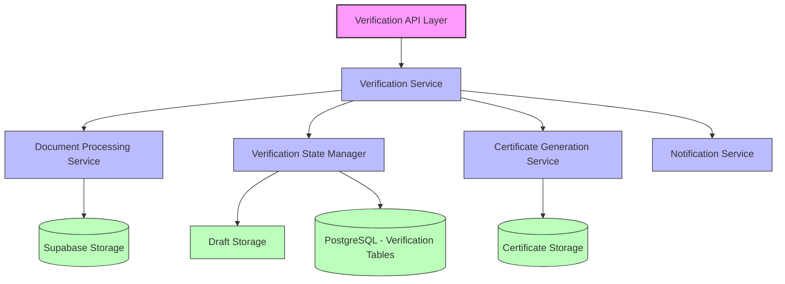
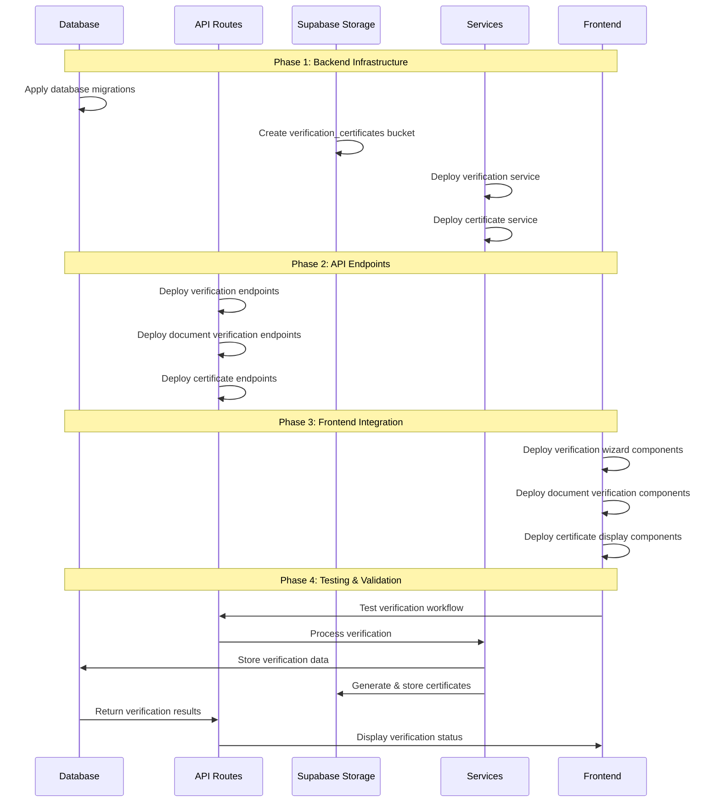

# BusinessOwnerWizard Backend Architecture Specification

## 1. Architectural Overview

The BusinessOwnerWizard backend provides a robust foundation for the verification workflow that Permit Managers use to validate Business Owner identities, addresses, and business associations. This document outlines the architectural components, data models, API contracts, security considerations, and performance optimizations necessary for implementing the verification system.

### 1.1 Core Components



### 1.2 System Context

The verification system interacts with several existing components:
- **Business Owner Module**: Provides owner data being verified
- **Document Management**: Stores and retrieves verification documents
- **Notification System**: Alerts owners and other stakeholders about verification status changes
- **Audit Logging**: Records all verification activities for compliance

## 2. Data Model Enhancements

### 2.1 Verification-Specific Schema Extensions

```prisma
model VerificationAttempt {
  id                String      @id @default(uuid())
  businessOwnerId   String
  businessOwner     BusinessOwner @relation(fields: [businessOwnerId], references: [id])
  initiatedBy       String      // User ID of Permit Manager
  initiatedAt       DateTime    @default(now())
  completedAt       DateTime?
  decision          VerificationDecision?
  decisionReason    String?
  certificateId     String?     @unique
  sections          Json        // Stores section-specific verification states
  draftData         Json?       // Latest auto-saved draft data
  lastUpdated       DateTime    @default(now()) @updatedAt
  documentVerifications DocumentVerification[]
  historyLog        VerificationHistoryLog[]
  
  @@index([businessOwnerId])
  @@index([initiatedBy])
}

enum VerificationDecision {
  VERIFIED
  REJECTED
  NEEDS_INFO
}

model DocumentVerification {
  id                String      @id @default(uuid())
  verificationId    String
  verification      VerificationAttempt @relation(fields: [verificationId], references: [id])
  documentId        String
  document          Document    @relation(fields: [documentId], references: [id])
  status            DocumentVerificationStatus
  notes             String?
  verifiedBy        String      // User ID
  verifiedAt        DateTime    @default(now())
  
  @@unique([verificationId, documentId])
  @@index([documentId])
}

enum DocumentVerificationStatus {
  PENDING
  VERIFIED
  UNREADABLE
  EXPIRED
  INCONSISTENT_DATA
  SUSPECTED_FRAUD
  OTHER_ISSUE
  NOT_APPLICABLE
}

model VerificationHistoryLog {
  id                String      @id @default(uuid())
  verificationId    String
  verification      VerificationAttempt @relation(fields: [verificationId], references: [id])
  action            String
  performedBy       String      // User ID
  performedAt       DateTime    @default(now())
  details           Json?
  
  @@index([verificationId])
}

model VerificationCertificate {
  id                String      @id @default(uuid())
  verificationId    String      @unique
  verification      VerificationAttempt @relation(fields: [verificationId], references: [id])
  issuedAt          DateTime    @default(now())
  expiresAt         DateTime
  documentPath      String      // Path in Supabase Storage
  verificationHash  String      // Digital fingerprint for validation
  isRevoked         Boolean     @default(false)
  revokedAt         DateTime?
  revokedReason     String?
  
  @@index([verificationId])
}

// Extend BusinessOwner model
model BusinessOwner {
  // Existing fields...
  
  // Added fields
  lastVerifiedAt              DateTime?
  verificationExpiresAt       DateTime?
  currentVerificationAttemptId String?
  currentVerificationAttempt   VerificationAttempt? @relation("CurrentVerification", fields: [currentVerificationAttemptId], references: [id])
  verificationAttempts         VerificationAttempt[]
  
  @@index([currentVerificationAttemptId])
}
```

### 2.2 Key Data Relationships

1. **BusinessOwner → VerificationAttempt**: One-to-many relationship tracking all verification attempts for an owner
2. **VerificationAttempt → DocumentVerification**: One-to-many relationship tracking status of each document within a verification
3. **VerificationAttempt → VerificationCertificate**: One-to-one relationship connecting successful verifications to their certificates

## 3. API Design & Endpoints

### 3.1 Verification API Routes

```typescript
// File: app/api/business-owners/[id]/verification/route.ts

// GET: Fetch current verification status or active attempt
export async function GET(
  request: Request,
  { params }: { params: { id: string } }
) {
  const { id } = params;
  const { searchParams } = new URL(request.url);
  const includeDocuments = searchParams.get('includeDocuments') === 'true';
  
  try {
    // Verify authentication and authorization first
    const user = await getAuthenticatedUser();
    if (!user || !hasPermission(user, 'business-owner:verify')) {
      return new Response(JSON.stringify({ error: 'Unauthorized' }), { 
        status: 403, 
        headers: { 'Content-Type': 'application/json' } 
      });
    }
    
    // Get verification data
    const verificationData = await verificationService.getVerificationStatus(
      id, 
      user.id, 
      includeDocuments
    );
    
    return new Response(JSON.stringify(verificationData), {
      status: 200,
      headers: { 'Content-Type': 'application/json' }
    });
  } catch (error) {
    console.error('Error fetching verification status:', error);
    return new Response(JSON.stringify({ error: 'Failed to fetch verification status' }), {
      status: 500,
      headers: { 'Content-Type': 'application/json' }
    });
  }
}

// POST: Create new verification attempt or save draft
export async function POST(
  request: Request,
  { params }: { params: { id: string } }
) {
  const { id } = params;
  
  try {
    // Verify authentication and authorization
    const user = await getAuthenticatedUser();
    if (!user || !hasPermission(user, 'business-owner:verify')) {
      return new Response(JSON.stringify({ error: 'Unauthorized' }), { 
        status: 403, 
        headers: { 'Content-Type': 'application/json' } 
      });
    }
    
    const body = await request.json();
    
    // Determine if this is a draft save or new verification attempt
    if (body.isDraft) {
      // Save draft
      const result = await verificationService.saveDraft(id, user.id, body.draftData);
      return new Response(JSON.stringify(result), {
        status: 200,
        headers: { 'Content-Type': 'application/json' }
      });
    } else {
      // Create new verification attempt
      const result = await verificationService.createVerificationAttempt(id, user.id);
      return new Response(JSON.stringify(result), {
        status: 201,
        headers: { 'Content-Type': 'application/json' }
      });
    }
  } catch (error) {
    console.error('Error creating verification attempt:', error);
    return new Response(JSON.stringify({ error: 'Failed to create verification attempt' }), {
      status: 500,
      headers: { 'Content-Type': 'application/json' }
    });
  }
}

// PUT: Submit verification decision
export async function PUT(
  request: Request,
  { params }: { params: { id: string } }
) {
  const { id } = params;
  
  try {
    // Verify authentication and authorization
    const user = await getAuthenticatedUser();
    if (!user || !hasPermission(user, 'business-owner:verify')) {
      return new Response(JSON.stringify({ error: 'Unauthorized' }), { 
        status: 403, 
        headers: { 'Content-Type': 'application/json' } 
      });
    }
    
    const body = await request.json();
    
    // Validate submission data using zod schema
    const validationResult = verificationSubmissionSchema.safeParse(body);
    if (!validationResult.success) {
      return new Response(JSON.stringify({ 
        error: 'Invalid verification data', 
        details: validationResult.error.format() 
      }), {
        status: 400,
        headers: { 'Content-Type': 'application/json' }
      });
    }
    
    // Submit verification decision
    const result = await verificationService.submitVerificationDecision(
      id, 
      user.id, 
      validationResult.data
    );
    
    return new Response(JSON.stringify(result), {
      status: 200,
      headers: { 'Content-Type': 'application/json' }
    });
  } catch (error) {
    console.error('Error submitting verification decision:', error);
    return new Response(JSON.stringify({ error: 'Failed to submit verification decision' }), {
      status: 500,
      headers: { 'Content-Type': 'application/json' }
    });
  }
}
```

### 3.2 Document Verification API Routes

```typescript
// File: app/api/business-owners/[id]/verification/documents/route.ts

// POST: Update document verification status
export async function POST(
  request: Request,
  { params }: { params: { id: string } }
) {
  const { id } = params;
  
  try {
    // Verify authentication and authorization
    const user = await getAuthenticatedUser();
    if (!user || !hasPermission(user, 'business-owner:verify')) {
      return new Response(JSON.stringify({ error: 'Unauthorized' }), { 
        status: 403, 
        headers: { 'Content-Type': 'application/json' } 
      });
    }
    
    const body = await request.json();
    
    // Validate document verification data
    const validationResult = documentVerificationSchema.safeParse(body);
    if (!validationResult.success) {
      return new Response(JSON.stringify({ 
        error: 'Invalid document verification data', 
        details: validationResult.error.format() 
      }), {
        status: 400,
        headers: { 'Content-Type': 'application/json' }
      });
    }
    
    // Update document verification status
    const result = await verificationService.updateDocumentVerification(
      id,
      user.id,
      validationResult.data
    );
    
    return new Response(JSON.stringify(result), {
      status: 200,
      headers: { 'Content-Type': 'application/json' }
    });
  } catch (error) {
    console.error('Error updating document verification:', error);
    return new Response(JSON.stringify({ error: 'Failed to update document verification' }), {
      status: 500,
      headers: { 'Content-Type': 'application/json' }
    });
  }
}
```

### 3.3 Certificate API Routes

```typescript
// File: app/api/business-owners/[id]/verification/certificate/route.ts

// GET: Generate or retrieve verification certificate
export async function GET(
  request: Request,
  { params }: { params: { id: string } }
) {
  const { id } = params;
  
  try {
    // Verify authentication and authorization
    const user = await getAuthenticatedUser();
    if (!user || !hasPermission(user, 'business-owner:verify')) {
      return new Response(JSON.stringify({ error: 'Unauthorized' }), { 
        status: 403, 
        headers: { 'Content-Type': 'application/json' } 
      });
    }
    
    // Generate or retrieve certificate
    const certificateData = await certificateService.getOrGenerateCertificate(id, user.id);
    
    return new Response(JSON.stringify(certificateData), {
      status: 200,
      headers: { 'Content-Type': 'application/json' }
    });
  } catch (error) {
    console.error('Error generating certificate:', error);
    return new Response(JSON.stringify({ error: 'Failed to generate certificate' }), {
      status: 500,
      headers: { 'Content-Type': 'application/json' }
    });
  }
}
```

## 4. Core Service Implementations

### 4.1 Verification Service

```typescript
// File: lib/services/verificationService.ts

import { prisma } from '@/lib/prisma';
import { supabase } from '@/lib/supabase';
import { certificateService } from './certificateService';
import { notificationService } from './notificationService';
import { auditService } from './auditService';
import { DocumentVerificationStatus, VerificationDecision } from '@prisma/client';

export const verificationService = {
  /**
   * Get current verification status or active attempt for a Business Owner
   */
  async getVerificationStatus(
    businessOwnerId: string,
    userId: string,
    includeDocuments: boolean = false
  ) {
    // Verify the owner is managed by this user
    const owner = await prisma.businessOwner.findFirst({
      where: {
        id: businessOwnerId,
        assignedManagerId: userId,
      },
      include: {
        currentVerificationAttempt: includeDocuments ? {
          include: {
            documentVerifications: {
              include: {
                document: true,
              },
            },
          },
        } : true,
      },
    });

    if (!owner) {
      throw new Error('Business owner not found or not managed by this user');
    }

    return {
      ownerId: owner.id,
      ownerName: `${owner.firstName} ${owner.lastName}`,
      verificationStatus: owner.verificationStatus,
      lastVerifiedAt: owner.lastVerifiedAt,
      verificationExpiresAt: owner.verificationExpiresAt,
      currentAttempt: owner.currentVerificationAttempt,
    };
  },

  /**
   * Save draft verification data
   */
  async saveDraft(
    businessOwnerId: string,
    userId: string,
    draftData: any
  ) {
    // Verify the owner is managed by this user
    const owner = await prisma.businessOwner.findFirst({
      where: {
        id: businessOwnerId,
        assignedManagerId: userId,
      },
    });

    if (!owner) {
      throw new Error('Business owner not found or not managed by this user');
    }

    // Find current verification attempt or create one
    let attempt = await prisma.verificationAttempt.findFirst({
      where: {
        businessOwnerId,
        completedAt: null,
      },
    });

    if (!attempt) {
      // Create new verification attempt
      attempt = await prisma.verificationAttempt.create({
        data: {
          businessOwnerId,
          initiatedBy: userId,
          sections: {},
          draftData,
        },
      });

      // Update owner with current attempt
      await prisma.businessOwner.update({
        where: { id: businessOwnerId },
        data: { currentVerificationAttemptId: attempt.id },
      });
    } else {
      // Update existing attempt with new draft data
      attempt = await prisma.verificationAttempt.update({
        where: { id: attempt.id },
        data: { draftData },
      });
    }

    // Log the draft save
    await auditService.logEvent({
      entityType: 'verification_attempt',
      entityId: attempt.id,
      action: 'draft_saved',
      performedBy: userId,
      details: { timestamp: new Date().toISOString() },
    });

    return { attemptId: attempt.id, savedAt: attempt.lastUpdated };
  },

  /**
   * Create new verification attempt
   */
  async createVerificationAttempt(
    businessOwnerId: string,
    userId: string
  ) {
    // Verify the owner is managed by this user
    const owner = await prisma.businessOwner.findFirst({
      where: {
        id: businessOwnerId,
        assignedManagerId: userId,
      },
    });

    if (!owner) {
      throw new Error('Business owner not found or not managed by this user');
    }

    // Check if there's already an active attempt
    const existingAttempt = await prisma.verificationAttempt.findFirst({
      where: {
        businessOwnerId,
        completedAt: null,
      },
    });

    if (existingAttempt) {
      return {
        attemptId: existingAttempt.id,
        message: 'Continuing existing verification attempt',
      };
    }

    // Create new verification attempt
    const attempt = await prisma.verificationAttempt.create({
      data: {
        businessOwnerId,
        initiatedBy: userId,
        sections: {
          identity: { status: 'pending' },
          address: { status: 'pending' },
          businessAffiliation: { status: 'pending' },
        },
      },
    });

    // Update owner with current attempt
    await prisma.businessOwner.update({
      where: { id: businessOwnerId },
      data: { currentVerificationAttemptId: attempt.id },
    });

    // Log the new attempt
    await auditService.logEvent({
      entityType: 'verification_attempt',
      entityId: attempt.id,
      action: 'attempt_created',
      performedBy: userId,
      details: { timestamp: new Date().toISOString() },
    });

    // Create verification history log
    await prisma.verificationHistoryLog.create({
      data: {
        verificationId: attempt.id,
        action: 'VERIFICATION_STARTED',
        performedBy: userId,
        details: { timestamp: new Date().toISOString() },
      },
    });

    return {
      attemptId: attempt.id,
      createdAt: attempt.initiatedAt,
    };
  },

  /**
   * Submit verification decision
   */
  async submitVerificationDecision(
    businessOwnerId: string,
    userId: string,
    data: {
      verificationId: string;
      decision: VerificationDecision;
      decisionReason?: string;
      sections: {
        identity: { status: string; notes?: string };
        address: { status: string; notes?: string };
        businessAffiliation: { status: string; notes?: string };
      };
    }
  ) {
    // Run in transaction for data consistency
    return await prisma.$transaction(async (tx) => {
      // Verify the owner is managed by this user
      const owner = await tx.businessOwner.findFirst({
        where: {
          id: businessOwnerId,
          assignedManagerId: userId,
        },
      });

      if (!owner) {
        throw new Error('Business owner not found or not managed by this user');
      }

      // Get the verification attempt
      const attempt = await tx.verificationAttempt.findUnique({
        where: { id: data.verificationId },
      });

      if (!attempt || attempt.businessOwnerId !== businessOwnerId) {
        throw new Error('Verification attempt not found or not associated with this owner');
      }

      if (attempt.completedAt) {
        throw new Error('This verification attempt has already been completed');
      }

      // Update the verification attempt
      const now = new Date();
      const updatedAttempt = await tx.verificationAttempt.update({
        where: { id: data.verificationId },
        data: {
          completedAt: now,
          decision: data.decision,
          decisionReason: data.decisionReason,
          sections: data.sections,
        },
      });

      // Update owner verification status based on decision
      let ownerUpdateData: any = {};
      
      if (data.decision === 'VERIFIED') {
        // Set verification details for approved verification
        const verificationValidityDays = 365; // 1 year validity
        const expiryDate = new Date();
        expiryDate.setDate(expiryDate.getDate() + verificationValidityDays);
        
        ownerUpdateData = {
          verificationStatus: 'VERIFIED',
          lastVerifiedAt: now,
          verificationExpiresAt: expiryDate,
          currentVerificationAttemptId: null, // Clear current attempt as it's complete
        };
        
        // Generate certificate for verified owners
        await certificateService.generateCertificate(data.verificationId, userId, tx);
      } else if (data.decision === 'REJECTED') {
        ownerUpdateData = {
          verificationStatus: 'REJECTED',
          currentVerificationAttemptId: null,
        };
      } else if (data.decision === 'NEEDS_INFO') {
        ownerUpdateData = {
          verificationStatus: 'NEEDS_INFO',
          currentVerificationAttemptId: null,
        };
      }
      
      // Update the owner
      await tx.businessOwner.update({
        where: { id: businessOwnerId },
        data: ownerUpdateData,
      });
      
      // Create verification history log
      await tx.verificationHistoryLog.create({
        data: {
          verificationId: data.verificationId,
          action: `VERIFICATION_${data.decision}`,
          performedBy: userId,
          details: {
            timestamp: now.toISOString(),
            reason: data.decisionReason,
          },
        },
      });
      
      // Log the verification decision
      await auditService.logEvent({
        entityType: 'verification_attempt',
        entityId: data.verificationId,
        action: `verification_${data.decision.toLowerCase()}`,
        performedBy: userId,
        details: {
          timestamp: now.toISOString(),
          reason: data.decisionReason,
        },
      }, tx);
      
      // Send notification to business owner
      await notificationService.sendVerificationNotification(
        businessOwnerId,
        data.decision,
        data.decisionReason
      );
      
      return {
        verificationId: data.verificationId,
        decision: data.decision,
        completedAt: updatedAttempt.completedAt,
        certificateId: data.decision === 'VERIFIED' ? 
          (await tx.verificationCertificate.findUnique({
            where: { verificationId: data.verificationId },
          }))?.id : null,
      };
    });
  },

  /**
   * Update document verification status
   */
  async updateDocumentVerification(
    businessOwnerId: string,
    userId: string,
    data: {
      verificationId: string;
      documentId: string;
      status: DocumentVerificationStatus;
      notes?: string;
    }
  ) {
    // Verify the owner is managed by this user
    const owner = await prisma.businessOwner.findFirst({
      where: {
        id: businessOwnerId,
        assignedManagerId: userId,
      },
    });

    if (!owner) {
      throw new Error('Business owner not found or not managed by this user');
    }

    // Get the verification attempt
    const attempt = await prisma.verificationAttempt.findUnique({
      where: { id: data.verificationId },
    });

    if (!attempt || attempt.businessOwnerId !== businessOwnerId) {
      throw new Error('Verification attempt not found or not associated with this owner');
    }

    if (attempt.completedAt) {
      throw new Error('This verification attempt has already been completed');
    }

    // Check if document verification already exists
    const existingVerification = await prisma.documentVerification.findUnique({
      where: {
        verificationId_documentId: {
          verificationId: data.verificationId,
          documentId: data.documentId,
        },
      },
    });

    // Create or update document verification
    let verification;
    if (existingVerification) {
      verification = await prisma.documentVerification.update({
        where: { id: existingVerification.id },
        data: {
          status: data.status,
          notes: data.notes,
          verifiedBy: userId,
          verifiedAt: new Date(),
        },
      });
    } else {
      verification = await prisma.documentVerification.create({
        data: {
          verificationId: data.verificationId,
          documentId: data.documentId,
          status: data.status,
          notes: data.notes,
          verifiedBy: userId,
        },
      });
    }

    // Log the document verification update
    await auditService.logEvent({
      entityType: 'document_verification',
      entityId: verification.id,
      action: 'document_verification_updated',
      performedBy: userId,
      details: {
        documentId: data.documentId,
        status: data.status,
        timestamp: verification.verifiedAt.toISOString(),
      },
    });

    return verification;
  },
};
```

### 4.2 Certificate Generation Service

```typescript
// File: lib/services/certificateService.ts

import { prisma } from '@/lib/prisma';
import { supabase } from '@/lib/supabase';
import { createHash } from 'crypto';
import { PDFDocument, StandardFonts, rgb } from 'pdf-lib';
import { Prisma, PrismaClient } from '@prisma/client';

export const certificateService = {
  /**
   * Generate verification certificate
   */
  async generateCertificate(
    verificationId: string,
    userId: string,
    tx?: Omit<PrismaClient, '$connect' | '$disconnect' | '$on' | '$transaction' | '$use'>
  ) {
    // Use provided transaction or fallback to regular prisma client
    const prismaClient = tx || prisma;
    
    // Get verification attempt with owner data
    const verification = await prismaClient.verificationAttempt.findUnique({
      where: { id: verificationId },
      include: {
        businessOwner: true,
      },
    });

    if (!verification) {
      throw new Error('Verification attempt not found');
    }

    if (verification.decision !== 'VERIFIED') {
      throw new Error('Cannot generate certificate for non-verified attempt');
    }

    // Check if certificate already exists
    const existingCertificate = await prismaClient.verificationCertificate.findUnique({
      where: { verificationId },
    });

    if (existingCertificate) {
      return existingCertificate;
    }

    // Generate verification hash
    const verificationData = JSON.stringify({
      verificationId,
      businessOwnerId: verification.businessOwnerId,
      verifiedBy: verification.initiatedBy,
      verifiedAt: verification.completedAt,
      ownerName: `${verification.businessOwner.firstName} ${verification.businessOwner.lastName}`,
    });
    
    const verificationHash = createHash('sha256').update(verificationData).digest('hex');

    // Set certificate expiration (1 year from verification)
    const expiresAt = new Date(verification.completedAt!);
    expiresAt.setFullYear(expiresAt.getFullYear() + 1);

    // Generate PDF certificate
    const pdfBytes = await this.generateCertificatePDF(verification, verificationHash, expiresAt);

    // Save PDF to Supabase Storage
    const filename = `certificate_${verificationId}.pdf`;
    const storagePath = `verification_certificates/${verification.businessOwnerId}/${filename}`;
    
    const { data: uploadData, error } = await supabase.storage
      .from('verification_documents')
      .upload(storagePath, pdfBytes, {
        contentType: 'application/pdf',
        upsert: true,
      });

    if (error) {
      throw new Error(`Failed to upload certificate: ${error.message}`);
    }

    // Create certificate record
    const certificate = await prismaClient.verificationCertificate.create({
      data: {
        verificationId,
        issuedAt: verification.completedAt!,
        expiresAt,
        documentPath: storagePath,
        verificationHash,
      },
    });

    return certificate;
  },

  /**
   * Get or generate verification certificate
   */
  async getOrGenerateCertificate(
    businessOwnerId: string,
    userId: string
  ) {
    // Verify the owner is managed by this user
    const owner = await prisma.businessOwner.findFirst({
      where: {
        id: businessOwnerId,
        assignedManagerId: userId,
      },
    });

    if (!owner) {
      throw new Error('Business owner not found or not managed by this user');
    }

    // Find the most recent verified verification attempt
    const verification = await prisma.verificationAttempt.findFirst({
      where: {
        businessOwnerId,
        decision: 'VERIFIED',
      },
      orderBy: {
        completedAt: 'desc',
      },
    });

    if (!verification) {
      throw new Error('No verified verification attempt found for this owner');
    }

    // Get existing certificate or generate a new one
    let certificate = await prisma.verificationCertificate.findUnique({
      where: { verificationId: verification.id },
    });

    if (!certificate) {
      certificate = await this.generateCertificate(verification.id, userId);
    }

    // Generate download URL
    const { data: urlData, error } = await supabase.storage
      .from('verification_documents')
      .createSignedUrl(certificate.documentPath, 60 * 60); // 1 hour expiry

    if (error) {
      throw new Error(`Failed to generate download URL: ${error.message}`);
    }

    return {
      certificateId: certificate.id,
      verificationId: verification.id,
      issuedAt: certificate.issuedAt,
      expiresAt: certificate.expiresAt,
      downloadUrl: urlData.signedUrl,
      verificationHash: certificate.verificationHash,
    };
  },

  /**
   * Generate PDF certificate document
   */
  async generateCertificatePDF(
    verification: any,
    verificationHash: string,
    expiresAt: Date
  ): Promise<Uint8Array> {
    // Create a new PDF document
    const pdfDoc = await PDFDocument.create();
    const page = pdfDoc.addPage([612, 792]); // US Letter size
    
    // Add fonts
    const helveticaFont = await pdfDoc.embedFont(StandardFonts.Helvetica);
    const helveticaBold = await pdfDoc.embedFont(StandardFonts.HelveticaBold);
    
    // Set page properties
    const { width, height } = page.getSize();
    const margin = 50;
    
    // Draw certificate border
    page.drawRectangle({
      x: margin,
      y: margin,
      width: width - (margin * 2),
      height: height - (margin * 2),
      borderWidth: 2,
      borderColor: rgb(0.1, 0.1, 0.1),
      color: rgb(0.98, 0.98, 0.98),
    });
    
    // Add certificate title
    page.drawText('PERMISORIA', {
      x: width / 2 - 100,
      y: height - 100,
      size: 24,
      font: helveticaBold,
      color: rgb(0.1, 0.1, 0.1),
    });
    
    page.drawText('VERIFICATION CERTIFICATE', {
      x: width / 2 - 120,
      y: height - 130,
      size: 16,
      font: helveticaBold,
      color: rgb(0.1, 0.1, 0.1),
    });
    
    // Add business owner details
    const owner = verification.businessOwner;
    page.drawText(`This certifies that`, {
      x: width / 2 - 60,
      y: height - 180,
      size: 12,
      font: helveticaFont,
      color: rgb(0.1, 0.1, 0.1),
    });
    
    page.drawText(`${owner.firstName} ${owner.lastName}`, {
      x: width / 2 - 100,
      y: height - 210,
      size: 18,
      font: helveticaBold,
      color: rgb(0.1, 0.1, 0.1),
    });
    
    page.drawText(`has been verified by Permisoria as a legitimate business owner`, {
      x: width / 2 - 180,
      y: height - 240,
      size: 12,
      font: helveticaFont,
      color: rgb(0.1, 0.1, 0.1),
    });
    
    // Add verification details
    page.drawText(`Verification ID: ${verification.id}`, {
      x: margin + 50,
      y: height - 300,
      size: 10,
      font: helveticaFont,
      color: rgb(0.1, 0.1, 0.1),
    });
    
    page.drawText(`Verification Date: ${verification.completedAt?.toDateString()}`, {
      x: margin + 50,
      y: height - 320,
      size: 10,
      font: helveticaFont,
      color: rgb(0.1, 0.1, 0.1),
    });
    
    page.drawText(`Expires On: ${expiresAt.toDateString()}`, {
      x: margin + 50,
      y: height - 340,
      size: 10,
      font: helveticaFont,
      color: rgb(0.1, 0.1, 0.1),
    });
    
    // Add verification hash
    page.drawText(`Verification Hash: ${verificationHash.substring(0, 16)}...`, {
      x: margin + 50,
      y: margin + 50,
      size: 8,
      font: helveticaFont,
      color: rgb(0.5, 0.5, 0.5),
    });
    
    // Add QR Code placeholder text (actual QR code would require additional library)
    page.drawRectangle({
      x: width - 150,
      y: margin + 50,
      width: 100,
      height: 100,
      borderWidth: 1,
      borderColor: rgb(0.1, 0.1, 0.1),
    });
    
    page.drawText('Scan to verify', {
      x: width - 150,
      y: margin + 30,
      size: 10,
      font: helveticaFont,
      color: rgb(0.1, 0.1, 0.1),
    });
    
    // Serialize the PDF to bytes
    return await pdfDoc.save();
  }
};
```

## 5. Security Considerations

### 5.1 Authorization Model

The verification wizard implements a robust, defense-in-depth security model:

1. **Authentication Layer**: Ensures only authenticated users can access verification endpoints
2. **Authorization Layer**: Validates that users have the `business-owner:verify` permission
3. **Ownership Verification**: Confirms the user is assigned as the Permit Manager for the business owner
4. **Verification Attempt Validation**: Ensures operations only affect current, eligible verification attempts
5. **Transaction Integrity**: Uses database transactions to maintain data consistency

### 5.2 Data Protection

```typescript
// Sensitive Data Protection Measures

// 1. SSN/Tax ID masking in API responses
const maskTaxId = (taxId: string): string => {
  if (!taxId || taxId.length < 4) return '****';
  return ''.padStart(taxId.length - 4, '*') + taxId.slice(-4);
};

// 2. Verification hash generation for certificate validation
const generateVerificationHash = (verificationData: any): string => {
  const dataString = JSON.stringify({
    verificationId: verificationData.id,
    ownerId: verificationData.businessOwnerId,
    verifiedBy: verificationData.initiatedBy,
    timestamp: verificationData.completedAt?.toISOString(),
  });
  
  return createHash('sha256').update(dataString).digest('hex');
};

// 3. Row-level security policy for verification data in Supabase
/*
CREATE POLICY "Verification attempts are only visible to assigned managers"
ON "public"."verification_attempts"
FOR SELECT
USING (
  auth.uid() IN (
    SELECT "assignedManagerId" 
    FROM "public"."business_owners" 
    WHERE "id" = "businessOwnerId"
  )
);
*/

// 4. Certificate token validation
const validateCertificateToken = async (token: string): Promise<boolean> => {
  const [certificateId, tokenHash] = token.split('.');
  
  const certificate = await prisma.verificationCertificate.findUnique({
    where: { id: certificateId },
    include: { verification: true },
  });
  
  if (!certificate) return false;
  
  const expectedHash = createHash('sha256')
    .update(`${certificate.id}${certificate.issuedAt.toISOString()}`)
    .digest('hex')
    .substring(0, 8);
  
  return tokenHash === expectedHash;
};
```

### 5.3 Audit Trail

All verification activities generate detailed audit records:

```typescript
// Example of comprehensive verification audit logs

interface VerificationAuditLog {
  timestamp: string;
  userId: string;
  userName: string;
  userRole: string;
  businessOwnerId: string;
  businessOwnerName: string;
  action: VerificationAction;
  details: {
    verificationId?: string;
    documentId?: string;
    oldStatus?: string;
    newStatus?: string;
    decisionReason?: string;
    metadata?: Record<string, any>;
  };
  ipAddress: string;
  userAgent: string;
}

enum VerificationAction {
  VERIFICATION_STARTED = 'verification_started',
  VERIFICATION_DRAFT_SAVED = 'verification_draft_saved',
  DOCUMENT_STATUS_UPDATED = 'document_status_updated',
  VERIFICATION_COMPLETED = 'verification_completed',
  VERIFICATION_APPROVED = 'verification_approved',
  VERIFICATION_REJECTED = 'verification_rejected',
  VERIFICATION_NEEDS_INFO = 'verification_needs_info',
  CERTIFICATE_GENERATED = 'certificate_generated',
  CERTIFICATE_DOWNLOADED = 'certificate_downloaded'
}

// These logs are stored in a dedicated table with retention policies
// and are available for compliance reporting and security audits
```

## 6. Performance Optimizations

### 6.1 Database Query Optimization

```typescript
// Efficient query patterns for verification workflows

// 1. Indexing strategy
/*
-- Primary indexes already created by Prisma for PKs and FKs

-- Custom indexes for performance
CREATE INDEX idx_verification_attempts_business_owner_id ON verification_attempts(business_owner_id);
CREATE INDEX idx_verification_attempts_initiated_by ON verification_attempts(initiated_by);
CREATE INDEX idx_verification_attempts_status ON verification_attempts(decision);
CREATE INDEX idx_document_verifications_document_id ON document_verifications(document_id);
CREATE INDEX idx_document_verifications_status ON document_verifications(status);
*/

// 2. Selective query with field filtering
const getVerificationMetrics = async (userId: string) => {
  return await prisma.verificationAttempt.findMany({
    where: {
      initiatedBy: userId,
      completedAt: { not: null },
    },
    select: {
      id: true,
      decision: true,
      completedAt: true,
      businessOwner: {
        select: {
          id: true,
          firstName: true,
          lastName: true,
        },
      },
    },
    orderBy: {
      completedAt: 'desc',
    },
    take: 20, // Limit results
  });
};

// 3. Batch operations for document status updates
const updateMultipleDocumentStatuses = async (
  verificationId: string,
  documentUpdates: Array<{ documentId: string, status: string, notes?: string }>,
  userId: string
) => {
  // Use transaction for atomicity
  return await prisma.$transaction(async (tx) => {
    const results = [];
    
    for (const update of documentUpdates) {
      const result = await tx.documentVerification.upsert({
        where: {
          verificationId_documentId: {
            verificationId,
            documentId: update.documentId,
          },
        },
        update: {
          status: update.status,
          notes: update.notes,
          verifiedBy: userId,
          verifiedAt: new Date(),
        },
        create: {
          verificationId,
          documentId: update.documentId,
          status: update.status,
          notes: update.notes,
          verifiedBy: userId,
        },
      });
      
      results.push(result);
    }
    
    return results;
  });
};
```

### 6.2 Certificate Generation Optimizations

```typescript
// Efficient certificate handling

// 1. Generate certificates asynchronously
const queueCertificateGeneration = async (verificationId: string, userId: string) => {
  // Queue the certificate generation task
  await prisma.backgroundTask.create({
    data: {
      type: 'CERTIFICATE_GENERATION',
      status: 'PENDING',
      payload: { verificationId, userId },
      priority: 'HIGH',
    },
  });
  
  // Return immediately with a placeholder response
  return {
    certificateId: null,
    status: 'QUEUED',
    message: 'Certificate generation has been queued and will be available shortly',
  };
};

// 2. Cache certificate download URLs
const getCachedCertificateUrl = async (certificateId: string): Promise<string> => {
  // Check Redis cache first
  const cachedUrl = await redis.get(`certificate_url:${certificateId}`);
  if (cachedUrl) return cachedUrl;
  
  // Generate new URL if not in cache
  const { data, error } = await supabase.storage
    .from('verification_documents')
    .createSignedUrl(`verification_certificates/${certificateId}.pdf`, 3600);
  
  if (error) throw new Error(`Failed to generate URL: ${error.message}`);
  
  // Cache the URL (expire slightly before the signed URL)
  await redis.set(`certificate_url:${certificateId}`, data.signedUrl, 'EX', 3500);
  
  return data.signedUrl;
};
```

### 6.3 API Response Optimization

```typescript
// Optimized API response patterns

// 1. Pagination for verification history
export async function GET(
  request: Request,
  { params }: { params: { id: string } }
) {
  const { id } = params;
  const { searchParams } = new URL(request.url);
  const page = parseInt(searchParams.get('page') || '1');
  const limit = Math.min(parseInt(searchParams.get('limit') || '10'), 50); // Max 50
  const offset = (page - 1) * limit;
  
  // Get paginated verification history
  const [verifications, total] = await Promise.all([
    prisma.verificationAttempt.findMany({
      where: { businessOwnerId: id },
      orderBy: { initiatedAt: 'desc' },
      skip: offset,
      take: limit,
      select: {
        id: true,
        initiatedAt: true,
        completedAt: true,
        decision: true,
        initiatedBy: true,
        // Only include necessary fields
      },
    }),
    prisma.verificationAttempt.count({
      where: { businessOwnerId: id },
    }),
  ]);
  
  // Return paginated response
  return new Response(JSON.stringify({
    data: verifications,
    pagination: {
      total,
      page,
      limit,
      pages: Math.ceil(total / limit),
    },
  }), {
    status: 200,
    headers: { 'Content-Type': 'application/json' },
  });
}

// 2. Conditional field inclusion
const includeDocuments = searchParams.get('includeDocuments') === 'true';
const includeHistory = searchParams.get('includeHistory') === 'true';

const verificationData = await prisma.verificationAttempt.findUnique({
  where: { id },
  include: {
    documentVerifications: includeDocuments ? {
      include: {
        document: true,
      },
    } : false,
    historyLog: includeHistory,
  },
});
```

## 7. Integration Points

### 7.1 Document Management Integration

The verification system integrates with the document management system for verification:

```typescript
// Document Service Integration for Verification

interface DocumentVerificationRequest {
  documentId: string;
  verificationId: string;
  status: DocumentVerificationStatus;
  notes?: string;
}

// Document service integration for verification workflow
const documentService = {
  // Get documents for verification
  async getDocumentsForVerification(businessOwnerId: string, category?: string): Promise<Document[]> {
    return await prisma.document.findMany({
      where: {
        ownerId: businessOwnerId,
        ...(category ? { category } : {}),
      },
      orderBy: {
        uploadedAt: 'desc',
      },
    });
  },
  
  // Get secure document URL for verification viewing
  async getDocumentUrl(documentId: string): Promise<string> {
    const document = await prisma.document.findUnique({
      where: { id: documentId },
    });
    
    if (!document) {
      throw new Error('Document not found');
    }
    
    // Generate short-lived signed URL (1 hour)
    const { data, error } = await supabase.storage
      .from('documents')
      .createSignedUrl(document.storagePath, 3600);
    
    if (error) {
      throw new Error(`Failed to generate document URL: ${error.message}`);
    }
    
    return data.signedUrl;
  },
  
  // Update document verification status
  async updateVerificationStatus(
    request: DocumentVerificationRequest,
    userId: string
  ): Promise<DocumentVerification> {
    return await verificationService.updateDocumentVerification(
      request.documentId,
      userId,
      request
    );
  },
};
```

### 7.2 Notification System Integration

The verification system triggers notifications at key points in the workflow:

```typescript
// Notification system integration

// Notification templates for verification events
const VERIFICATION_TEMPLATES = {
  VERIFICATION_STARTED: {
    title: 'Verification Process Started',
    message: 'A verification process has been initiated for your business owner profile.',
    priority: 'MEDIUM',
    channels: ['IN_APP', 'EMAIL'],
  },
  VERIFICATION_VERIFIED: {
    title: 'Verification Approved',
    message: 'Your business owner profile has been successfully verified.',
    priority: 'HIGH',
    channels: ['IN_APP', 'EMAIL', 'SMS'],
  },
  VERIFICATION_REJECTED: {
    title: 'Verification Rejected',
    message: 'Your business owner profile verification was rejected. See details for more information.',
    priority: 'HIGH',
    channels: ['IN_APP', 'EMAIL', 'SMS'],
  },
  VERIFICATION_NEEDS_INFO: {
    title: 'Additional Information Needed',
    message: 'Your business owner verification requires additional information or documentation.',
    priority: 'HIGH',
    channels: ['IN_APP', 'EMAIL'],
  },
};

// Send verification notification
async function sendVerificationNotification(
  businessOwnerId: string,
  decision: VerificationDecision,
  decisionReason?: string
): Promise<void> {
  // Get business owner
  const owner = await prisma.businessOwner.findUnique({
    where: { id: businessOwnerId },
    include: {
      user: true, // Get associated user for notification
    },
  });
  
  if (!owner || !owner.user) {
    console.error('Failed to send notification: Owner or user not found');
    return;
  }
  
  // Get template based on decision
  const templateKey = `VERIFICATION_${decision}` as keyof typeof VERIFICATION_TEMPLATES;
  const template = VERIFICATION_TEMPLATES[templateKey];
  
  if (!template) {
    console.error(`No notification template found for decision: ${decision}`);
    return;
  }
  
  // Create notification payload
  const payload = {
    userId: owner.user.id,
    title: template.title,
    message: template.message,
    details: {
      businessOwnerId,
      decision,
      decisionReason,
      timestamp: new Date().toISOString(),
    },
    priority: template.priority,
  };
  
  // Send notifications through configured channels
  if (template.channels.includes('IN_APP')) {
    await notificationService.sendInAppNotification(payload);
  }
  
  if (template.channels.includes('EMAIL') && owner.user.email) {
    await notificationService.sendEmailNotification({
      ...payload,
      email: owner.user.email,
      templateId: `verification_${decision.toLowerCase()}_email`,
    });
  }
  
  if (template.channels.includes('SMS') && owner.phone) {
    await notificationService.sendSmsNotification({
      ...payload,
      phone: owner.phone,
      templateId: `verification_${decision.toLowerCase()}_sms`,
    });
  }
}
```

## 8. Migration & Deployment Strategy

### 8.1 Database Migration Plan

```sql
-- Migration: Add verification tables

-- Create VerificationAttempt table
CREATE TABLE "VerificationAttempt" (
  "id" UUID NOT NULL DEFAULT gen_random_uuid(),
  "businessOwnerId" UUID NOT NULL,
  "initiatedBy" UUID NOT NULL,
  "initiatedAt" TIMESTAMP(3) NOT NULL DEFAULT CURRENT_TIMESTAMP,
  "completedAt" TIMESTAMP(3),
  "decision" TEXT,
  "decisionReason" TEXT,
  "certificateId" UUID,
  "sections" JSONB NOT NULL DEFAULT '{}',
  "draftData" JSONB,
  "lastUpdated" TIMESTAMP(3) NOT NULL DEFAULT CURRENT_TIMESTAMP,
  
  CONSTRAINT "VerificationAttempt_pkey" PRIMARY KEY ("id"),
  CONSTRAINT "VerificationAttempt_businessOwnerId_fkey" FOREIGN KEY ("businessOwnerId") REFERENCES "BusinessOwner"("id") ON DELETE CASCADE ON UPDATE CASCADE,
  CONSTRAINT "VerificationAttempt_certificateId_fkey" FOREIGN KEY ("certificateId") REFERENCES "VerificationCertificate"("id") ON DELETE SET NULL ON UPDATE CASCADE
);

-- Create DocumentVerification table
CREATE TABLE "DocumentVerification" (
  "id" UUID NOT NULL DEFAULT gen_random_uuid(),
  "verificationId" UUID NOT NULL,
  "documentId" UUID NOT NULL,
  "status" TEXT NOT NULL,
  "notes" TEXT,
  "verifiedBy" UUID NOT NULL,
  "verifiedAt" TIMESTAMP(3) NOT NULL DEFAULT CURRENT_TIMESTAMP,
  
  CONSTRAINT "DocumentVerification_pkey" PRIMARY KEY ("id"),
  CONSTRAINT "DocumentVerification_verificationId_documentId_key" UNIQUE ("verificationId", "documentId"),
  CONSTRAINT "DocumentVerification_verificationId_fkey" FOREIGN KEY ("verificationId") REFERENCES "VerificationAttempt"("id") ON DELETE CASCADE ON UPDATE CASCADE,
  CONSTRAINT "DocumentVerification_documentId_fkey" FOREIGN KEY ("documentId") REFERENCES "Document"("id") ON DELETE CASCADE ON UPDATE CASCADE
);

-- Create VerificationHistoryLog table
CREATE TABLE "VerificationHistoryLog" (
  "id" UUID NOT NULL DEFAULT gen_random_uuid(),
  "verificationId" UUID NOT NULL,
  "action" TEXT NOT NULL,
  "performedBy" UUID NOT NULL,
  "performedAt" TIMESTAMP(3) NOT NULL DEFAULT CURRENT_TIMESTAMP,
  "details" JSONB,
  
  CONSTRAINT "VerificationHistoryLog_pkey" PRIMARY KEY ("id"),
  CONSTRAINT "VerificationHistoryLog_verificationId_fkey" FOREIGN KEY ("verificationId") REFERENCES "VerificationAttempt"("id") ON DELETE CASCADE ON UPDATE CASCADE
);

-- Create VerificationCertificate table
CREATE TABLE "VerificationCertificate" (
  "id" UUID NOT NULL DEFAULT gen_random_uuid(),
  "verificationId" UUID NOT NULL,
  "issuedAt" TIMESTAMP(3) NOT NULL DEFAULT CURRENT_TIMESTAMP,
  "expiresAt" TIMESTAMP(3) NOT NULL,
  "documentPath" TEXT NOT NULL,
  "verificationHash" TEXT NOT NULL,
  "isRevoked" BOOLEAN NOT NULL DEFAULT false,
  "revokedAt" TIMESTAMP(3),
  "revokedReason" TEXT,
  
  CONSTRAINT "VerificationCertificate_pkey" PRIMARY KEY ("id"),
  CONSTRAINT "VerificationCertificate_verificationId_key" UNIQUE ("verificationId"),
  CONSTRAINT "VerificationCertificate_verificationId_fkey" FOREIGN KEY ("verificationId") REFERENCES "VerificationAttempt"("id") ON DELETE CASCADE ON UPDATE CASCADE
);

-- Add new fields to BusinessOwner table
ALTER TABLE "BusinessOwner" 
ADD COLUMN "lastVerifiedAt" TIMESTAMP(3),
ADD COLUMN "verificationExpiresAt" TIMESTAMP(3),
ADD COLUMN "currentVerificationAttemptId" UUID,
ADD CONSTRAINT "BusinessOwner_currentVerificationAttemptId_fkey" FOREIGN KEY ("currentVerificationAttemptId") REFERENCES "VerificationAttempt"("id") ON DELETE SET NULL ON UPDATE CASCADE;

-- Create indexes for performance
CREATE INDEX "VerificationAttempt_businessOwnerId_idx" ON "VerificationAttempt"("businessOwnerId");
CREATE INDEX "VerificationAttempt_initiatedBy_idx" ON "VerificationAttempt"("initiatedBy");
CREATE INDEX "VerificationAttempt_decision_idx" ON "VerificationAttempt"("decision");
CREATE INDEX "DocumentVerification_documentId_idx" ON "DocumentVerification"("documentId");
CREATE INDEX "DocumentVerification_status_idx" ON "DocumentVerification"("status");
CREATE INDEX "VerificationHistoryLog_verificationId_idx" ON "VerificationHistoryLog"("verificationId");
CREATE INDEX "BusinessOwner_currentVerificationAttemptId_idx" ON "BusinessOwner"("currentVerificationAttemptId");

-- Add RLS policies
ALTER TABLE "VerificationAttempt" ENABLE ROW LEVEL SECURITY;
ALTER TABLE "DocumentVerification" ENABLE ROW LEVEL SECURITY;
ALTER TABLE "VerificationHistoryLog" ENABLE ROW LEVEL SECURITY;
ALTER TABLE "VerificationCertificate" ENABLE ROW LEVEL SECURITY;

-- Create verification storage bucket in Supabase
-- (This would be done through Supabase API or dashboard)
```

### 8.2 Deployment Sequence



## 9. Testing Strategy

### 9.1 Unit Tests for Verification Services

```typescript
// File: tests/unit/verification-service.test.ts

import { verificationService } from '@/lib/services/verificationService';
import { prisma } from '@/lib/prisma';

// Mock prisma and other dependencies
jest.mock('@/lib/prisma', () => ({
  businessOwner: {
    findFirst: jest.fn(),
    update: jest.fn(),
  },
  verificationAttempt: {
    findFirst: jest.fn(),
    findUnique: jest.fn(),
    create: jest.fn(),
    update: jest.fn(),
  },
  verificationHistoryLog: {
    create: jest.fn(),
  },
  $transaction: jest.fn((callback) => callback(prisma)),
}));

describe('VerificationService', () => {
  beforeEach(() => {
    jest.clearAllMocks();
  });
  
  describe('getVerificationStatus', () => {
    it('should return verification status for a valid owner', async () => {
      // Arrange
      const ownerId = 'test-owner-id';
      const userId = 'test-user-id';
      const mockOwner = {
        id: ownerId,
        firstName: 'John',
        lastName: 'Doe',
        verificationStatus: 'UNVERIFIED',
        lastVerifiedAt: null,
        verificationExpiresAt: null,
        currentVerificationAttempt: null,
      };
      
      prisma.businessOwner.findFirst.mockResolvedValue(mockOwner);
      
      // Act
      const result = await verificationService.getVerificationStatus(ownerId, userId);
      
      // Assert
      expect(prisma.businessOwner.findFirst).toHaveBeenCalledWith({
        where: {
          id: ownerId,
          assignedManagerId: userId,
        },
        include: {
          currentVerificationAttempt: true,
        },
      });
      
      expect(result).toEqual({
        ownerId: mockOwner.id,
        ownerName: 'John Doe',
        verificationStatus: 'UNVERIFIED',
        lastVerifiedAt: null,
        verificationExpiresAt: null,
        currentAttempt: null,
      });
    });
    
    it('should throw error for unauthorized access', async () => {
      // Arrange
      prisma.businessOwner.findFirst.mockResolvedValue(null);
      
      // Act & Assert
      await expect(
        verificationService.getVerificationStatus('test-owner-id', 'unauthorized-user')
      ).rejects.toThrow('Business owner not found or not managed by this user');
    });
  });
  
  // Additional tests for saveDraft, createVerificationAttempt, submitVerificationDecision, etc.
});
```

### 9.2 Integration Tests for API Endpoints

```typescript
// File: tests/integration/verification-api.test.ts

import { createMocks } from 'node-mocks-http';
import { GET, POST, PUT } from '@/app/api/business-owners/[id]/verification/route';

// Mock authentication
jest.mock('@/lib/auth', () => ({
  getAuthenticatedUser: jest.fn().mockResolvedValue({
    id: 'test-user-id',
    email: 'test@example.com',
    role: 'permit_manager',
  }),
  hasPermission: jest.fn().mockReturnValue(true),
}));

// Mock verification service
jest.mock('@/lib/services/verificationService', () => ({
  getVerificationStatus: jest.fn(),
  saveDraft: jest.fn(),
  createVerificationAttempt: jest.fn(),
  submitVerificationDecision: jest.fn(),
}));

import { verificationService } from '@/lib/services/verificationService';

describe('Verification API Routes', () => {
  beforeEach(() => {
    jest.clearAllMocks();
  });
  
  describe('GET /api/business-owners/[id]/verification', () => {
    it('should return verification status', async () => {
      // Arrange
      const { req, res } = createMocks({
        method: 'GET',
        query: { id: 'test-owner-id' },
      });
      
      const mockVerificationStatus = {
        ownerId: 'test-owner-id',
        ownerName: 'John Doe',
        verificationStatus: 'UNVERIFIED',
        lastVerifiedAt: null,
        verificationExpiresAt: null,
        currentAttempt: null,
      };
      
      verificationService.getVerificationStatus.mockResolvedValue(mockVerificationStatus);
      
      // Act
      const response = await GET(req, { params: { id: 'test-owner-id' } });
      const data = await response.json();
      
      // Assert
      expect(response.status).toBe(200);
      expect(data).toEqual(mockVerificationStatus);
      expect(verificationService.getVerificationStatus).toHaveBeenCalledWith(
        'test-owner-id',
        'test-user-id',
        false
      );
    });
    
    // Additional tests for error cases
  });
  
  // Tests for POST and PUT endpoints
});
```

### 9.3 End-to-End Tests

```typescript
// File: tests/e2e/verification-workflow.test.ts
// (Using Cypress or Playwright)

describe('Business Owner Verification Workflow', () => {
  beforeEach(() => {
    // Login as Permit Manager
    cy.login('permit-manager@example.com', 'password');
    
    // Navigate to Business Owner detail page
    cy.visit('/business-owners/test-owner-id');
    cy.get('[data-testid="start-verification-button"]').should('be.visible');
  });
  
  it('should complete the entire verification workflow', () => {
    // Start verification
    cy.get('[data-testid="start-verification-button"]').click();
    cy.get('[data-testid="verification-wizard-modal"]').should('be.visible');
    
    // Step 1: Welcome
    cy.get('[data-testid="wizard-next-button"]').click();
    
    // Step 2: Identity Verification
    cy.get('[data-testid="document-status-selector"]').first().select('VERIFIED');
    cy.get('[data-testid="identity-verification-notes"]').type('ID verified successfully');
    cy.get('[data-testid="mark-identity-verified"]').click();
    cy.get('[data-testid="wizard-next-button"]').click();
    
    // Step 3: Address Verification
    cy.get('[data-testid="document-status-selector"]').first().select('VERIFIED');
    cy.get('[data-testid="address-verification-notes"]').type('Address verified successfully');
    cy.get('[data-testid="mark-address-verified"]').click();
    cy.get('[data-testid="wizard-next-button"]').click();
    
    // Step 4: Business Affiliation
    cy.get('[data-testid="business-affiliation-type-new"]').click();
    cy.get('[data-testid="mark-affiliation-verified"]').click();
    cy.get('[data-testid="wizard-next-button"]').click();
    
    // Step 5: Summary
    cy.get('[data-testid="verification-decision-approve"]').click();
    cy.get('[data-testid="verification-final-notes"]').type('All documents verified successfully');
    cy.get('[data-testid="wizard-complete-button"]').click();
    
    // Step 6: Completion
    cy.get('[data-testid="verification-certificate-id"]').should('be.visible');
    cy.get('[data-testid="download-certificate-button"]').should('be.visible');
    cy.get('[data-testid="close-wizard-button"]').click();
    
    // Verify owner status updated
    cy.get('[data-testid="owner-verification-status"]').should('contain', 'Verified');
  });
  
  // Additional test cases for rejection and needs-info flows
});
```

## 10. Business Owner Verification Certificate Format

The verification certificate is a critical output of the verification process. Here's the detailed structure:

### 10.1 Certificate Data Structure

```typescript
interface VerificationCertificate {
  id: string;                    // Unique certificate ID
  verificationId: string;        // Associated verification attempt
  businessOwnerId: string;       // ID of verified business owner
  ownerName: string;             // Full name of business owner
  issuedAt: Date;                // Issuance timestamp
  expiresAt: Date;               // Expiration date (typically 1 year)
  verifiedBy: string;            // ID of Permit Manager who completed verification
  verifierName: string;          // Name of Permit Manager
  verificationScope: string[];   // Aspects verified (identity, address, business)
  certificateNumber: string;     // Human-readable certificate number
  verificationHash: string;      // Cryptographic hash for validation
  qrCodeData: string;            // Data for QR code validation
  documentPath: string;          // Storage path to PDF certificate
}
```

### 10.2 Certificate Visual Design

```
┌─────────────────────────────────────────────────────────┐
│                      PERMISORIA                         │
│                VERIFICATION CERTIFICATE                 │
├─────────────────────────────────────────────────────────┤
│                                                         │
│  This certifies that                                    │
│                                                         │
│           [BUSINESS OWNER NAME]                         │
│                                                         │
│  has been verified by Permisoria as a legitimate        │
│  business owner.                                        │
│                                                         │
├─────────────────────────────────────────────────────────┤
│  VERIFICATION DETAILS                                   │
│                                                         │
│  Certificate Number: [CERT-12345-ABCDE]                 │
│  Verification ID: [UUID]                                │
│  Verified On: [DATE]                                    │
│  Expires On: [DATE]                                     │
│  Verified By: [PERMIT MANAGER NAME]                     │
│                                                         │
│  Verification Scope:                                    │
│   ✓ Identity Verification                              │
│   ✓ Address Verification                               │
│   ✓ Business Association                               │
│                                                         │
├─────────────────────────────────────────────────────────┤
│                                        ┌───────────┐    │
│  Verification Hash:                    │           │    │
│  [PARTIAL HASH DISPLAY]                │  QR CODE  │    │
│                                        │           │    │
│  Verify at: verify.permisoria.com      └───────────┘    │
│                                                         │
└─────────────────────────────────────────────────────────┘
```

## 11. Conclusion

The BusinessOwnerWizard backend architecture provides a robust, secure, and performant foundation for the verification workflow. It integrates seamlessly with the existing document management system and implements comprehensive audit logging for compliance. The modular design allows for future enhancements and extensions to the verification process.

Key technical highlights include:
- Transactional integrity across verification steps
- Defense-in-depth security model
- Comprehensive audit trails
- Optimized database queries and indexes
- Scalable certificate generation and storage
- Integration with notification system for status updates

This implementation fulfills all requirements outlined in the business owner verification specification and provides a solid foundation for the frontend wizard components to build upon.